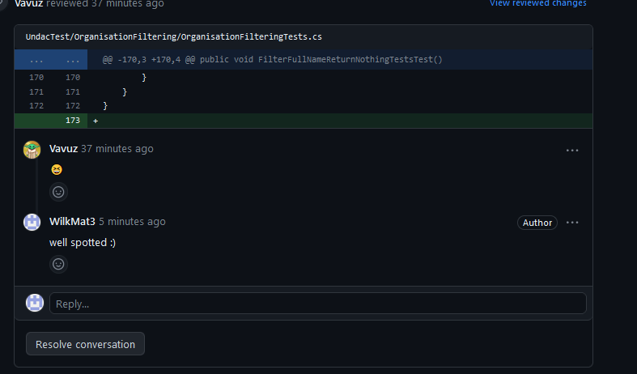
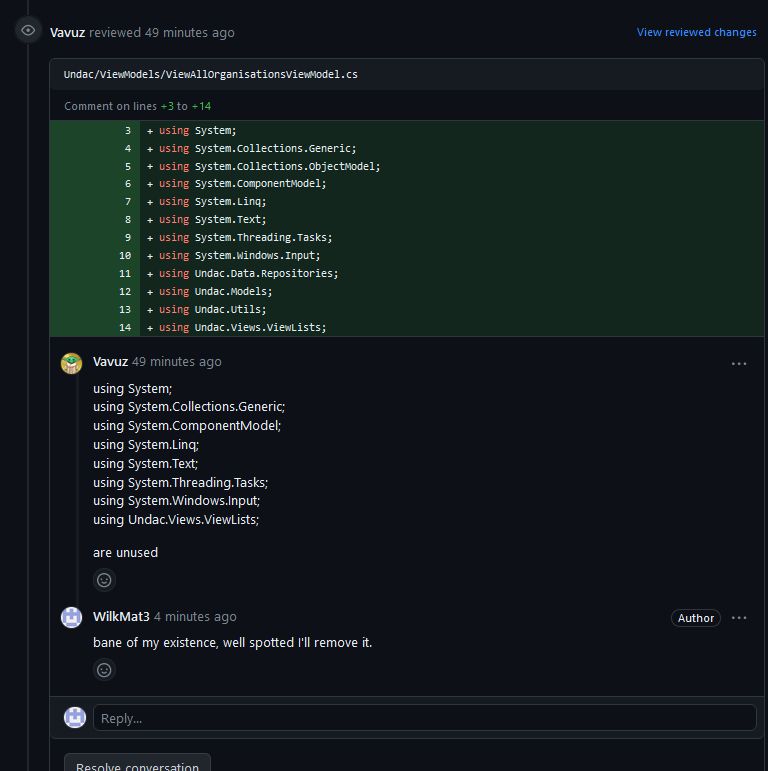
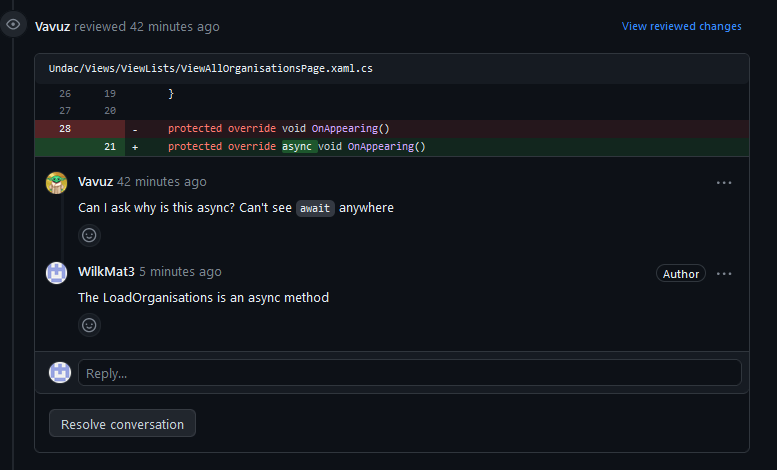
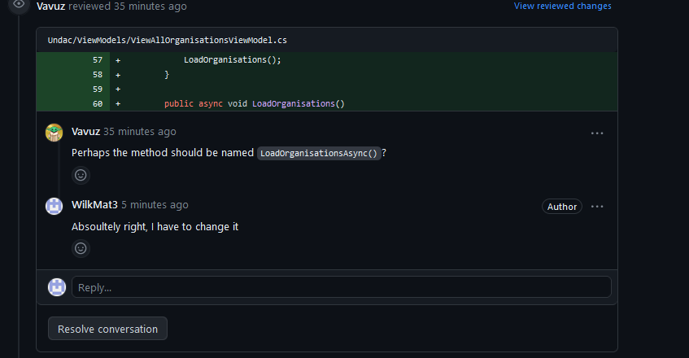
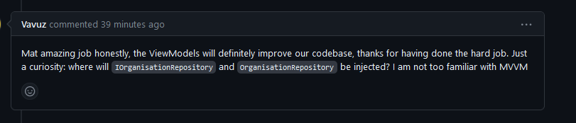
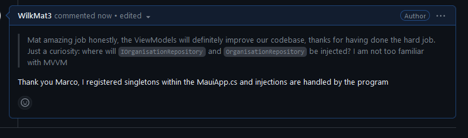
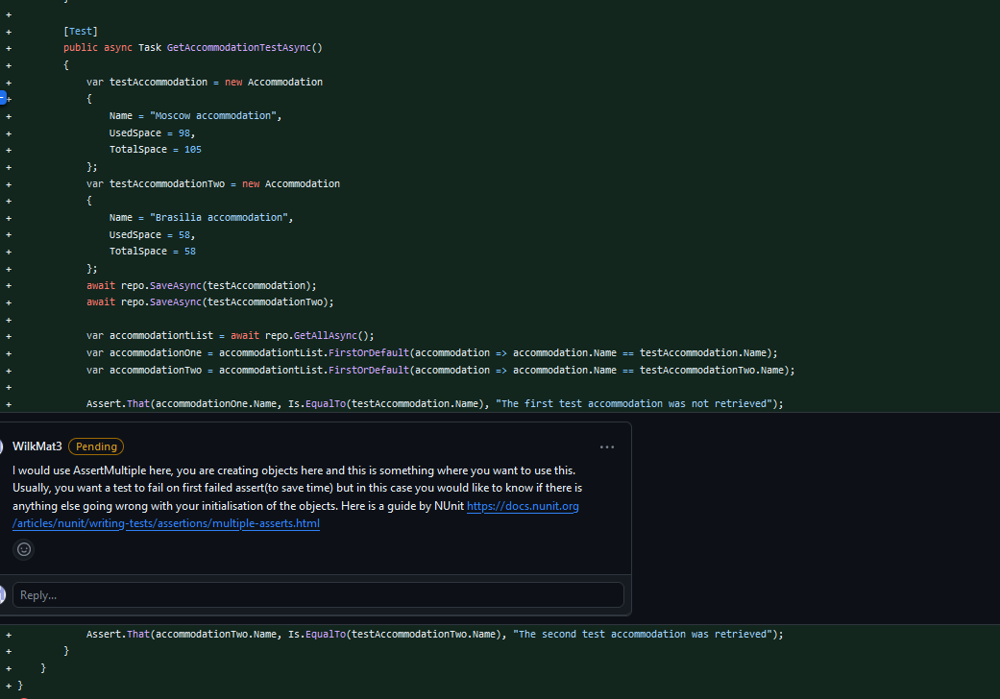
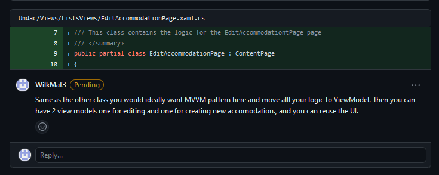
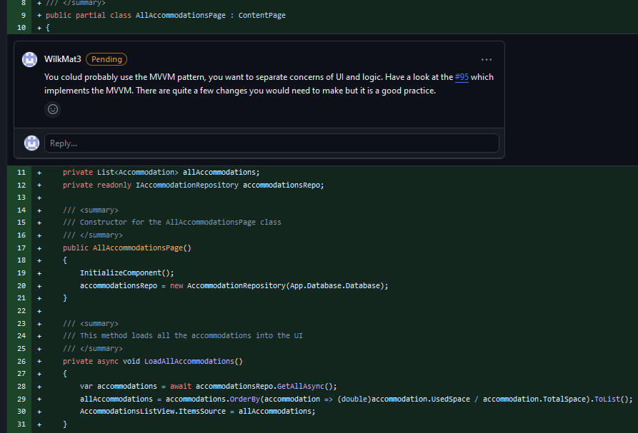

# Project work 2

## Summary

This week I have been building on the work from last week by working on the [Maintain view lists of partner agencies (UN, International, national, NGO, voluntary)](https://github.com/xinjoonha/SET09102_PURPLE/issues/64). Previously I have struggled to implement the MVVM pattern for the ViewAllOrganisationsPage but this week I have been able to incorporate it into my code. I have resorted to using MVVM community toolkit version 8.0.0 as it was the latest one that has not caused any issues when running the application. In summary, I made the following changes to the code:

*+ added view model for ViewAllorganisationsPage


*+ changed XAML file so it can work with the view model


*+ added lazy initialization to the repository pattern 


*+ registered singletons for the view, view model, and repositories.


*+ cleaned up not needed database initialization within the App.xaml.cs


```
<?xml version="1.0" encoding="utf-8" ?>
<ContentPage xmlns="http://schemas.microsoft.com/dotnet/2021/maui"
             xmlns:x="http://schemas.microsoft.com/winfx/2009/xaml"
             x:Class="Undac.Views.ViewLists.ViewAllOrganisationsPage"
             xmlns:viewmodel ="clr-namespace:Undac.ViewModels"
             xmlns:model="clr-namespace:Undac.Models"
             x:DataType="viewmodel:ViewAllOrganisationsViewModel"
             BackgroundColor="{DynamicResource PageBackgroundColor}"
             Padding="16"
             Title="Search Organisations">
    <StackLayout>
        <Label Text="Filter Organisations" FontSize="Large" TextColor="{DynamicResource PrimaryTextColor}" HorizontalOptions="Center" Margin="10,20,10,0" />

        <SearchBar x:Name="FullTextSearchBar" SearchCommand ="{Binding FilterOrganisationsCommand}" Placeholder="Search by full text" Margin="10,10,10,0" BackgroundColor="{DynamicResource SearchBarBackgroundColor}" Text="{Binding FullNameFilter}" />
        <SearchBar x:Name="CurrentAssociationSearchBar" SearchCommand ="{Binding FilterOrganisationsCommand}"  Placeholder="Search by Current Association Status" Margin="10,10,10,0" BackgroundColor="{DynamicResource SearchBarBackgroundColor}" Text="{Binding AssociationFilter}" />

        <ListView x:Name="OrganisationListView" ItemsSource="{Binding FilteredOrganisations}" ItemTapped="OnOrganisationSelected" SeparatorColor="{DynamicResource ListViewSeparatorColor}">
            <ListView.ItemTemplate>
                <DataTemplate x:DataType="model:Organisation">
                    <ViewCell>
                        <StackLayout Margin="0,10,0,10" Padding="10" BackgroundColor="{DynamicResource ListItemBackgroundColor}">
                            <Label Text="{Binding Name}" FontAttributes="Bold" FontSize="16" TextColor="{DynamicResource TitleTextColor}" />
                            <Label Text="{Binding CurrentAssociation}" FontAttributes="Bold" FontSize="12" TextColor="Yellow" />
                        </StackLayout>
                    </ViewCell>
                </DataTemplate>
            </ListView.ItemTemplate>
        </ListView>
    </StackLayout>
</ContentPage>
```

*Figure 1: Xaml for the ViewAllOrganisationPage*

I made several changes to the XAML file for the ViewModel to work with the UI.
I had to add references to the *ViewAllOrganisationViewModel* but also to the *Undac.Models* as can be seen in the top part of Figure 1. I specified the ViewModel namespace and the view model itself for this XAML file.
The addition of UndacModel reference is because of the need to display a list of organisation objects. Within the ListView I added *x:DataType="model:Organisation"* so that the UI knows which type of object it will be displaying and it can access its properties. 


```
   <SearchBar x:Name="FullTextSearchBar" SearchCommand ="{Binding FilterOrganisationsCommand}" Placeholder="Search by full text" Margin="10,10,10,0" BackgroundColor="{DynamicResource SearchBarBackgroundColor}" Text="{Binding FullNameFilter}" />
   <SearchBar x:Name="CurrentAssociationSearchBar" SearchCommand ="{Binding FilterOrganisationsCommand}"  Placeholder="Search by Current Association Status" Margin="10,10,10,0" BackgroundColor="{DynamicResource SearchBarBackgroundColor}" Text="
```

*Figure 2: Xaml - Search bars*


```
        [RelayCommand]
        public void FilterOrganisations()
        {
            FilteredOrganisations = new ObservableCollection<Organisation>(AllOrganisation);
            var filteredOrganisations = FilteredOrganisations.ToList();
           
            if (!string.IsNullOrWhiteSpace(fullNameFilter))
            {
                filteredOrganisations = FilterMethods.FilterFullText(filteredOrganisations, fullNameFilter.ToLower());
            }

            if (!string.IsNullOrWhiteSpace(associationFilter))
            {
                filteredOrganisations = FilterMethods.FilterAssociation(filteredOrganisations, associationFilter.ToLower());
            }

            FilteredOrganisations = new ObservableCollection<Organisation>(filteredOrganisations);
        }
```

*Figure 3: ModelView - Search bar logic*

I have added Search commands to the XAML which I bound with the method/command in the view model using the RelayCommand annotation as can be seen in Figures 2 and 3. The logic for filtering is moved to a different static class that handles the filtering.
I had to keep two separate lists for organisations to make sure that filtering ran smoothly. 


```
        public string FullNameFilter
        {
            get => FullNameFilter;
            set
            {
                SetProperty(ref fullNameFilter, value);
                FilterOrganisationsCommand.Execute(null);
            }
        }

        public string AssociationFilter
        {
            get => associationFilter;
            set
            {
                SetProperty(ref associationFilter, value);
                FilterOrganisationsCommand.Execute(null);
            }
        }
```

*Figure 4: ModelView - Triggering the command*

As per Figure 4, anytime one of the search bars changes the FilterOrganisation command/method is executed. This is something I came across thanks to the ChatGpt when trying to figure out how to trigger the filter method for search bars.


```
        public ViewAllOrganisationsViewModel(IOrganisationRepository organisationRepository)
        {
            _organisationRepository = organisationRepository;
            LoadOrganisationsAsync();
        }
```

*Figure 5: ModelView - Constructor*


```
        builder.Services.AddSingleton<IOrganisationRepository, OrganisationRepository>();
        builder.Services.AddSingleton<ViewAllOrganisationsPage>();
        builder.Services.AddTransient<OrganisationStatusPage>();
```

*Figure 6: Dependecy Injection - registering singletons for dependecy injection service*

In the constructor for the view model(Fig 5), I inject the interface required for loading organisations from the database, the *LoadOrganisationAsync* method just retrieves a list of organisations from the database. I also registered both with the MAUI dependency injection service(Fig 6). 


```
public partial class ViewAllOrganisationsPage : ContentPage
{
    private IOrganisationRepository _organisationRepository;

    private ViewAllOrganisationsViewModel _viewModel;

    public ViewAllOrganisationsPage( ViewAllOrganisationsViewModel viewModel, IOrganisationRepository repository)
	{
        _organisationRepository = repository;
        BindingContext = viewModel;
        InitializeComponent();
    }

    protected override async void OnAppearing()
    {
        base.OnAppearing();
        if (_viewModel == null)
        {
            _viewModel = new ViewAllOrganisationsViewModel(_organisationRepository); 
            BindingContext = _viewModel; 
        }
        _viewModel.LoadOrganisations(); 
    }

    private async void OnOrganisationSelected(object sender, ItemTappedEventArgs e)
    {
        if (e.Item is Organisation organisation)
        {
            await Navigation.PushAsync(new OrganisationStatusPage(organisation, _organisationRepository));
        }
    }
}
```

*Figure 7: View - changes to the view code behind class*

Thanks to the view model my View class shrank significantly. I only required the OnAppearing method because the Page needs to navigate to the page where we change the status of the organisation and in return it needs to update the view. 
Aside from that I am handling an event where the user navigates to another page to edit the status of an organisation. 
Last week I did not implement this functionality for a few reasons but one of them was connected to initialising a component before the binding context was set.


```

    public class Repository<TEntity> : IRepository<TEntity> where TEntity : class, new()
    {

        public readonly UndacDatabase database;

        public Repository(UndacDatabase database)
        {
            this.database = database;

        }

        public async Task<List<TEntity>> GetAllAsync()
        {
            await database.Init();
            return await database.Connection.Table<TEntity>().ToListAsync();
        }

        public async Task<TEntity> GetAsync(int id)
        {
            await database.Init();
            var query = database.Connection.Table<TEntity>();
            var idProperty = typeof(TEntity).GetProperty("Id");

            if (idProperty != null && idProperty.PropertyType == typeof(int))
            {
                return await database.Connection.FindAsync<TEntity>(id);
            }
            else
            {
                throw new InvalidOperationException($"The entity of type {typeof(TEntity).Name} does not have an 'Id' property.");
            }

            return await query.FirstOrDefaultAsync();
        }

        public async Task<int> SaveAsync(TEntity item)
        {
            await database.Init();
            if (item == null)
                throw new ArgumentNullException(nameof(item));

            var identifiable = item as IIdentifiable;
            if (identifiable != null && identifiable.Id != 0)
            {
                return await database.Connection.UpdateAsync(item);
            }
            else
            {
                return await database.Connection.InsertAsync(item);
            }
        }

        public async Task<int> DeleteAsync(TEntity item)
        {
            await database.Init();
            if (item == null)
                throw new ArgumentNullException(nameof(item));

            return await database.Connection.DeleteAsync(item);
        }
    }
```

*Figure 8: Repository - changes to the class*

Another important part of my update is that I have used lazy initialisation. Firstly instead of passing the SQLlite connection in the constructor I inject the database. This allowed me to add a database.Init() to each method thus allowing for lazy initialisation when a method is called.


## Testing

I have conducted extensive manual testing and ensured all of the unit tests pass. This PR is an improvement to the work from the previous week thus my tests remained the same. I have extracted the methods for filtering the organisation's list into a static class. Below are my tests:

```
        [Test]
        public void FilterFullNameTest()
        {
            var testOrganisation = new Organisation
            {
                Name = "Test",
                CurrentAssociation = "Pending"
            };
            var testOrganisation2 = new Organisation
            {
                Name = "No Common",
                CurrentAssociation = "Approved"
            };

            List<Organisation> organisationList = new List<Organisation>();
            organisationList.Add(testOrganisation);
            organisationList.Add(testOrganisation2);

            List<Organisation> filteredList = FilterMethods.FilterFullText(organisationList, "Test");

            var filteredName = filteredList.First().Name;
            Assert.Multiple(() =>
            {
                Assert.That(filteredList.Count, Is.EqualTo(1), "List is too long");
                Assert.That(filteredList, Is.Not.Null, "filtered list should not be null");
                Assert.That(filteredName, Is.EqualTo(testOrganisation.Name), "Filter was not applied");
            });

        }
```

*Figure 9: Testing FullFilter*

In Figure 9 I have checked how text is filtered for the full filter. I provided two objects to check that only filtered result is returned.


```
        [Test]
        public void FilterAssociationTest()
        {
            var testOrganisation = new Organisation
            {
                Name = "Test",
                CurrentAssociation = "Pending"
            };
            var testOrganisation2 = new Organisation
            {
                Name = "No Common",
                CurrentAssociation = "Approved"
            };

            List<Organisation> organisationList = new List<Organisation>();
            organisationList.Add(testOrganisation);
            organisationList.Add(testOrganisation2);

            List<Organisation> filteredList = FilterMethods.FilterAssociation(organisationList, testOrganisation2.CurrentAssociation);

            var filteredName = filteredList.First().CurrentAssociation;

            Assert.Multiple(() =>
            {
                Assert.That(filteredList.Count, Is.EqualTo(1), "List is too long");
                Assert.That(filteredList, Is.Not.Null, "filtered list should not be null");
                Assert.That(filteredName, Is.EqualTo(testOrganisation2.CurrentAssociation), "Filter was not applied");
            });
        }
```

*Figure 10: Testing AssociationFilter*

Similar to the other test method I have created one that tests association status as per Figure 10.


```
        [Test]
        public void FilterFullNameReturnMultipleTestsTest()
        {
            var testOrganisation = new Organisation
            {
                Name = "Test",
                CurrentAssociation = "Pending"
            };
            var testOrganisation2 = new Organisation
            {
                Name = "No Common",
                CurrentAssociation = "Approved"
            };
            var testOrganisation3 = new Organisation
            {
                Name = "Test213",
                CurrentAssociation = "Pending"
            };

            List<Organisation> organisationList = new List<Organisation>();
            organisationList.Add(testOrganisation);
            organisationList.Add(testOrganisation2);
            organisationList.Add(testOrganisation3);

            List<Organisation> filteredList = FilterMethods.FilterFullText(organisationList, testOrganisation.Name);

            var filteredName = filteredList.First().Name;
            Assert.Multiple(() =>
            {
                Assert.That(filteredList.Count, Is.EqualTo(2), "List length is not correct");
                Assert.That(filteredList, Is.Not.Null, "filtered list should not be null");
                Assert.That(filteredName, Is.EqualTo(testOrganisation.Name), "Filter was not applied");
            });

        }
```

*Figure 11: Testing returning multiple results on the Full Filter*


```
        [Test]
        public void FilterAssociationReturnMultipleTest()
        {
            var testOrganisation = new Organisation
            {
                Name = "Test",
                CurrentAssociation = "Pending"
            };
            var testOrganisation2 = new Organisation
            {
                Name = "No Common",
                CurrentAssociation = "Approved"
            };
            var testOrganisation3 = new Organisation
            {
                Name = "No Common2",
                CurrentAssociation = "Approved"
            };

            List<Organisation> organisationList = new List<Organisation>();
            organisationList.Add(testOrganisation);
            organisationList.Add(testOrganisation2);
            organisationList.Add(testOrganisation3);

            List<Organisation> filteredList = FilterMethods.FilterAssociation(organisationList, testOrganisation2.CurrentAssociation);

            var filteredName = filteredList.First().CurrentAssociation;

            Assert.Multiple(() =>
            {
                Assert.That(filteredList.Count, Is.EqualTo(2), "List length is not correct");
                Assert.That(filteredList, Is.Not.Null, "filtered list should not be null");
                Assert.That(filteredName, Is.EqualTo(testOrganisation2.CurrentAssociation), "Filter was not applied");
            });
        }
```
*Figure 12: Testing returning multiple results on the Association Filter*

I have also wanted to test how filtering works when there are partial matches for more than one result as per Figures 11 and 12.


```
        [Test]
        public void FilterFullNameReturnNothingTestsTest()
        {
            var testOrganisation = new Organisation
            {
                Name = "Test",
                CurrentAssociation = "Pending"
            };
            var testOrganisation2 = new Organisation
            {
                Name = "No Common",
                CurrentAssociation = "Approved"
            };
            var testOrganisation3 = new Organisation
            {
                Name = "Test213",
                CurrentAssociation = "Pending"
            };

            List<Organisation> organisationList = new List<Organisation>();
            organisationList.Add(testOrganisation);
            organisationList.Add(testOrganisation2);
            organisationList.Add(testOrganisation3);

            List<Organisation> filteredList = FilterMethods.FilterFullText(organisationList, "Abracadabra");

            Assert.That(filteredList.Count, Is.EqualTo(0), "List length is not correct");
        }
```
*Figure 13: Testing no matching result*

Finally, I have considered the case when there is no match for the searched phrase and I have tested if the method will result in returning an empty list. 


## Getting my code reviewed

I am not getting a large number of code reviews despite asking multiple times on the Discord group. I know that there are a few reasons for it. Firstly, we do not have too many engaged group members. Secondly, I try to innovate every week and add something new and valuable to the project. This means that people are not familiar with the new functionality(Repository pattern or MVVM) and they do not have much to add apart from review from the perspective of coding conventions and formatting. 
This week I received a review from my colleague in which he pointed out a few mistakes that I repeated in the past. I struggle with empty lines and forget about removing unused references. I am dyslexic so I have to take extra care when reviewing the formatting of my code but there seems to be always something that I miss. I think I should start looking into some kind of linting tool to help me with that. 

This week I only had one occurrence of an extra empty line in my code, in the past that happened to me much more often.




*Figure 14: Review comment - Empty line 

To address this I removed the empty line, I think the linting tool would make sense since I keep repeating my mistakes. On the positive side, I only had one occurence of this issue in this PR.




*Figure 15: Review comment - unused reference

In Figure 15 I have documented another common mistake I make. Visual Studio adds a lot of sometimes unnecessary references to my code. I keep forgetting about checking that. This is something I need to stay on top of but I think a linting tool could help to highlight this. I removed unused references from the code. 




*Figure 16: Review comment - incorrect name




*Figure 17: Review comment - incorrect name second comment

Figures 16 & 17 refer to the same issue which is the incorrect name of the method. Analyser in Visual studio does not pick it up and I did not rename the method accordingly. Async methods should finish on "Async". 
To amend that I changed the name of the method as suggested in Figure 17.




*Figure 18: Review comment - query about code 




*Figure 19: Review comment - query about code - explanation


The comment in Figure 18 was unusual as it was mostly asking for clarification. I provided a brief explanation as per the Figure 19. I explained where the dependency is registered within our app. 


## Leading a code review

This week's code review I completed was on [View the current status of all OSOCC accommodation so that I can ensure that all personal and operational space needs are met](https://github.com/xinjoonha/SET09102_PURPLE/issues/90).

I looked through the list of basic code issues such as formatting, naming conventions or code smells. This pull request did not implement the MVVM pattern so I included comments regarding that and some explanations on why it should be done.

```
using Undac.Models;
using Undac.Data.Repositories;

namespace Undac.Views.ListsViews;

/// <summary>
/// This class contains the logic for the AllAccommodationPage page
/// </summary>
public partial class AllAccommodationsPage : ContentPage
{
    private List<Accommodation> allAccommodations;
    private readonly IAccommodationRepository accommodationsRepo;

    /// <summary>
    /// Constructor for the AllAccommodationsPage class
    /// </summary>
    public AllAccommodationsPage()
    {
        InitializeComponent();
        accommodationsRepo = new AccommodationRepository(App.Database.Database);
    }

    /// <summary>
    /// This method loads all the accommodations into the UI
    /// </summary>
    private async void LoadAllAccommodations()
    {
        var accommodations = await accommodationsRepo.GetAllAsync();
        allAccommodations = accommodations.OrderBy(accommodation => (double)accommodation.UsedSpace / accommodation.TotalSpace).ToList();
        AccommodationsListView.ItemsSource = allAccommodations;
    }

    /// <summary>
    /// This method loads all the accommodations whenever we navigate to the page
    /// </summary>
    protected override void OnAppearing()
    {
        base.OnAppearing();
        LoadAllAccommodations();
    }

    /// <summary>
    /// This method handles the navigation to the page for creating an accommodation
    /// </summary>
    private async void AddAccommodationClicked(object sender, EventArgs e)
    {
        await Navigation.PushAsync(new EditAccommodationPage(null, accommodationsRepo));
    }

    /// <summary>
    /// This method handles the navigation on a clicked item
    /// </summary>
    /// <param name="sender"></param>
    /// <param name="e"></param>
    private async void OnAccommodationClicked(object sender, ItemTappedEventArgs e)
    {
        if (e.Item is Accommodation accommodation)
        {
            await Navigation.PushAsync(new EditAccommodationPage(accommodation, accommodationsRepo));
        }
    }

    /// <summary>
    /// This method handles the file download
    /// </summary>
    private async void DownloadFileClicked(object sender, EventArgs e)
    {
        Uri uri = new Uri("https://www.researchgate.net/publication/307576584" +
                          "/figure/fig2/AS:408535839068161@1474413942986/Number-of-users-and-" +
                          "number-of-events-in-the-Virtual-OSOCC-Country-colors-indicate-the.png");
        await Browser.Default.OpenAsync(uri, BrowserLaunchMode.SystemPreferred);
    }
}
```

*Figure 20: Review code - AllAccommodationsPage code




*Figure 21: Review comment - Explanation of issue raised

In Figure 20, ideally, we would want to use using MVVM pattern to separate UI from logic to make the code more testable and readable amongst other reasons. I provided the comment as per Figure 21 explaining why and gave the example of another PR that is implementing this pattern.
In terms of the code smell, I could not find any issues. Methods are fairly short an condensed, names are meaningful and the code is formatted correctly.

```
using Undac.Data.Repositories;
using Undac.Models;

namespace Undac.Views.ListsViews;

/// <summary>
/// This class contains the logic for the EditAccommodationtPage page
/// </summary>
public partial class EditAccommodationPage : ContentPage
{
    private Accommodation accommodation;
    private readonly IAccommodationRepository _accommodationsRepo;

    /// <summary>
    /// Constructor for the EditAccommodationtPage class
    /// </summary>
    /// <param name="accommodation">The accommodation to edit</param>
    public EditAccommodationPage(Accommodation accommodation, IAccommodationRepository accommodationsRepo)
    {
        InitializeComponent();

        this.accommodation = accommodation;
        _accommodationsRepo = accommodationsRepo;

        // Checking whether we are creating or editing an accommodation
        if (accommodation == null)
        {
            Title = "Create Accommodation";
        }
        else
        {
            NameEntry.Text = accommodation.Name;
            UsedEntry.Text = accommodation.UsedSpace.ToString();
            TotalEntry.Text = accommodation.TotalSpace.ToString();
        }
    }

    /// <summary>
    /// This method updates an accommodation
    /// </summary>
    public async void OnConfirmClicked(object sender, EventArgs e)
    {
        if (string.IsNullOrWhiteSpace(NameEntry.Text) ||
            string.IsNullOrWhiteSpace(UsedEntry.Text) ||
            string.IsNullOrWhiteSpace(TotalEntry.Text) ||
            !int.TryParse(UsedEntry.Text, out _) ||
            !int.TryParse(TotalEntry.Text, out _))
        {
            await DisplayAlert("Error", "One of the fields is invalid", "OK");
            return;
        }

        var usedSpace = int.Parse(UsedEntry.Text);
        var totalSpace = int.Parse(TotalEntry.Text);

        if (usedSpace > totalSpace)
        {
            await DisplayAlert("Error", "The used spaces can't be more than the total available spaces!", "OK");
            return;
        }

        // Accommodation is null if we are creating one
        accommodation ??= new Accommodation();

        accommodation.Name = NameEntry.Text;
        accommodation.UsedSpace = usedSpace;
        accommodation.TotalSpace = totalSpace;

        await _accommodationsRepo.SaveAsync(accommodation);
        await Navigation.PopAsync();
    }
}
```

*Figure 22: Review code - another view that could use MVVM pattern*




*Figure 23: Review comment - another explanation of how we can use MVVM 

In Figure 22 we have another class that could use the MVVM pattern, in my comment (Figure 23) I provided a good reason why it could be used. The UI for Creating/Editing could be reused if two view models with logic are created thus separating the functionality and making code more readable. This would only require setting the binding context to the respective model. 


```
        [Test]
        public async Task GetAccommodationTestAsync()
        {
            var testAccommodation = new Accommodation
            {
                Name = "Moscow accommodation",
                UsedSpace = 98,
                TotalSpace = 105
            };
            var testAccommodationTwo = new Accommodation
            {
                Name = "Brasilia accommodation",
                UsedSpace = 58,
                TotalSpace = 58
            };
            await repo.SaveAsync(testAccommodation);
            await repo.SaveAsync(testAccommodationTwo);

            var accommodationtList = await repo.GetAllAsync();
            var accommodationOne = accommodationtList.FirstOrDefault(accommodation => accommodation.Name == testAccommodation.Name);
            var accommodationTwo = accommodationtList.FirstOrDefault(accommodation => accommodation.Name == testAccommodationTwo.Name);

            Assert.That(accommodationOne.Name, Is.EqualTo(testAccommodation.Name), "The first test accommodation was not retrieved");
            Assert.That(accommodationTwo.Name, Is.EqualTo(testAccommodationTwo.Name), "The second test accommodation was retrieved");
        }
```

*Figure 24: Review code - Multiple Asserts explanation




*Figure 25: Review comment - Multiple Asserts explanation

In Figure 24 we can see a test that has two assert statements. During my work placement, I have learned that using Assert.Multiple is a good solution when creating two objects that we want to check within the test. In Figure 25 I provided a more detailed explanation as to why this is the case and provided a source for more in-depth knowledge.  


## Reflections


### Challanges & learnings

This week I deepened my understanding of how dependency injection is managed automatically by the MAUI app. Thanks to looking into the tutorial and Microsoft documentation I was able to implement that in my code. Learning new concepts takes time and even though I had a good understanding of dependency injection I was not sure how this is handled by the app. 
Thanks to learning about MVVM I was also exposed to information about XAML and how to connect UI to the ViewModel. I learned more about Commands and Bindings as well as referencing classes in XAML. To some extent, I finally feel that MAUI and .NET app development "clicked" for me as I am getting more confident each week in developing the application. My next goal is to learn more about Entity Framework and look into deploying the SQL database on Azure using my free student account. I want to learn those things as app development with .Net is often using Azure and most of the applications these days are cloud-based therefore understanding how to connect my app to a remote database could be quite an important step in my path to becoming a software developer. Similarly, Entity Framework is often used when developing .Net applications. 

I also started using ChatGPT to explain some of those concepts to me. On one side it is a great resource which can speed up my learning as it provides a lot of valuable information without needing to search the internet. On the other hand by searching for information "manually" I learn more things as I also get the information not strictly related to what I am looking for. The convenience of using ChatGPT is removing that experience from my learning process. 
Overall, I decided to use it when debugging errors in code and "translating" the information from official Microsoft documentation as it is not a pleasant read most of the time. It is really good at giving me information on how to implement something set by step and provides a good explanation. Previously, I relied mostly on tutorials and partially on documentation but now I have another tool that I can use while learning new concepts. The information from the ChatGPT is not always reliable so I have to make sure that I cross-reference it with other sources as well. 

I mentioned that when working on the project I focus on introducing new/different functionalities in order to maximise my learning. This puts me in a peculiar position when I am getting my code reviewed, as no one is familiar with the code but I realised that this is a way others can actually learn from my pull requests as well. I think this is even better than following a tutorial as this is the code base they are already familiar with and it should make it easier. Previously I implemented the Repository pattern and everyone was on board with that idea. Interestingly, all PRs since implemented the Repository pattern that I created and I feel like I made a contribution to the learning process of my teammates. Before I have not considered this aspect of code review. I only thought that you learned from feedback on your pull request but now I can see another aspect of it. Implementing something new can boost the knowledge of my colleagues. 

I noticed that we have not changed our team workflow for a while. To be fair this is good that we do not think about it anymore just get on with the work. It probably means that we got used to it, in my case this is somehow ingrained in the process because I followed a similar workflow during my work placement. Overall, teamwork this week was much worse than before. We only had a few PRs up for review by Friday night. I think that we had few people leaving the group for various reasons and this affected the number of people engaging in the group project.

### My personal workflow

Recently, I have been struggling with staying focused when working on a project for multiple hours. I have many courseworks and assessments and every day I study multiple hours without having much time to relax. As I am not a robot sometimes my mind wanders and I cannot focus on what I want to do. On top of that, there are many distractions around and sometimes I cannot focus on the task at hand.
I decided to try a Pomodoro technique after a conversation with one of my colleagues from the group. For every 50 minutes of work, I take a 10-minute break. Additionally, I removed all other distractions from my room(my phone).

This allowed me to complete more work within a few hours than what I used to complete in a day. By separating time for work and rest I became more efficient and organised.
Retrospectively, I regret not doing it before but overall I have shown that I can adapt when things do not go as planned and I can find a solution to a problem.
This might seem not related to the subject but in the real world we do have to complete projects on time and being efficient is a necessity when working with Agile methodology. I was also happy that I discussed my issues with someone from the group. Overall, I learned something useful by following advice and showed that I reach out for help when I struggle in order to improve as soon as possible.  


[Figure 14]: https://github.com/WilkMat3/SET09102_Personal_Portfolio/blob/main/images/Comment_emptyLine.png "Figure 14"

[Figure 15]: https://github.com/WilkMat3/SET09102_Personal_Portfolio/blob/main/images/Comment_references.png "Figure 15"

[Figure 16]: https://github.com/WilkMat3/SET09102_Personal_Portfolio/blob/main/images/Comment_IncorrectName.png "Figure 16"

[Figure 17]: https://github.com/WilkMat3/SET09102_Personal_Portfolio/blob/main/images/Comment_Incorrect2.png "Figure 17"

[Figure 18]: https://github.com/WilkMat3/SET09102_Personal_Portfolio/blob/main/images/Positive_comment.png "Figure 18"

[Figure 19]: https://github.com/WilkMat3/SET09102_Personal_Portfolio/blob/main/images/Comment_asnwer.png "Figure 19"

[Figure 21]: https://github.com/WilkMat3/SET09102_Personal_Portfolio/blob/main/images/Week10CodeReview1.png "Figure 21"

[Figure 23]: https://github.com/WilkMat3/SET09102_Personal_Portfolio/blob/main/images/Week10CodeReview3.png "Figure 23"

[Figure 25]: https://github.com/WilkMat3/SET09102_Personal_Portfolio/blob/main/images/Week10CodeReview2.png "Figure 25"

