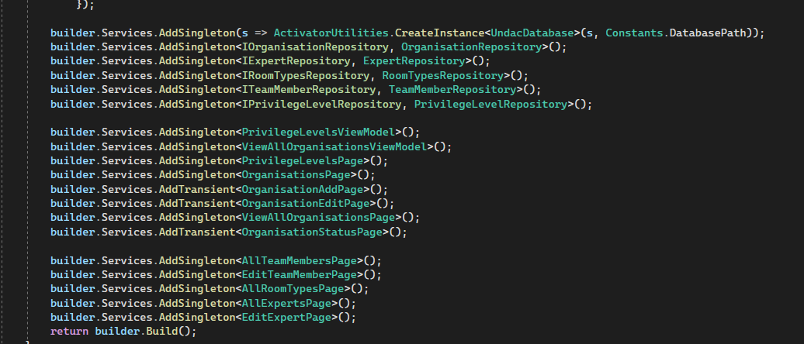
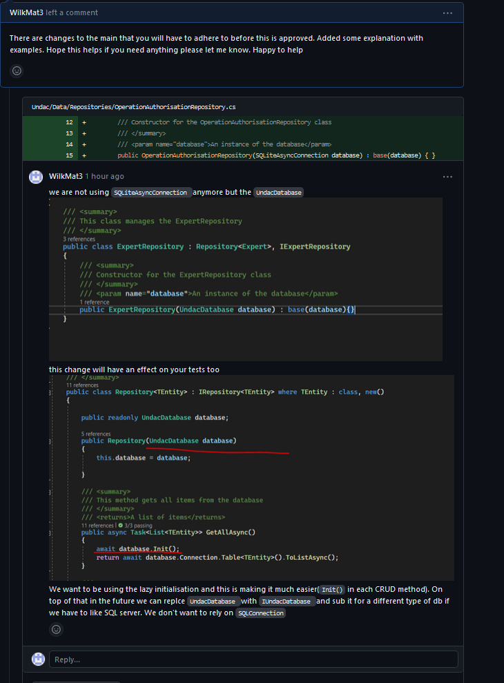
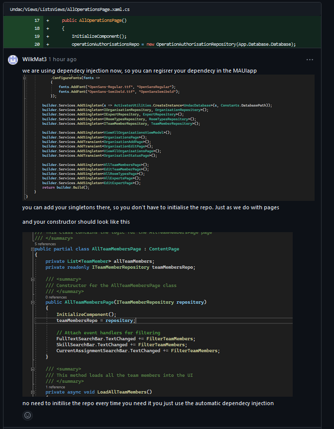
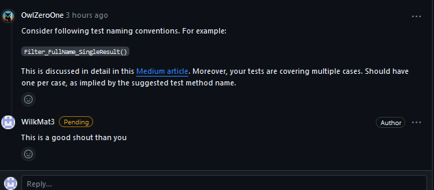
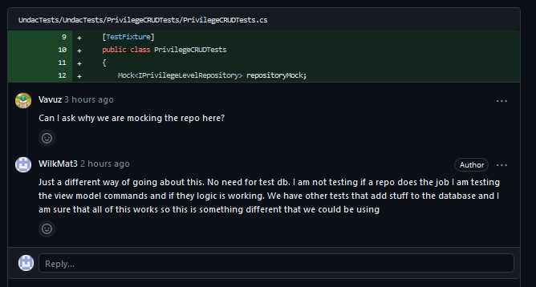
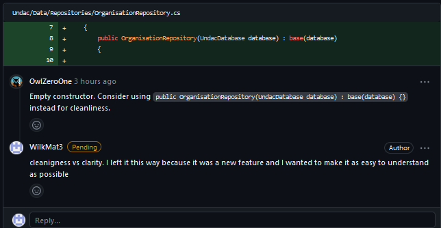

# Week 11 protfolio

## Summary 

This week I was doing some work connected to cleaning up the main branch and I was working on the ticket from week 3 that was not implemented correctly. We have only 4 active group members now including myself.  [Maintain reference values for system privilege levels](https://github.com/xinjoonha/SET09102_PURPLE/issues/19). Firstly, I had to close the pull request that was initially done for this feature as it was not implemented correctly and would not work, moreover, the person who has completed work for this feature is no longer in our group. Secondly, I have changed the ticket requirements to include the ID as per Fig 1.

```
End user goal: To be able to list, create, update and delete reference values for system privilege levels

End business goal: To have appropriate levels available to describe a system privilege (e.g. 'public', 'user', 'admin', etc.)

Acceptance criteria:

    A system privilege level item can be created, viewed, updated and deleted (CRUD functionality)

Measurement of success:

    Unit tests pass for all CRUD operations

Notes:

    The database table will be called system_privilege_level
    The table will have a columns name and 'ID'

```
*Figure 1 - acceptance criteria for the ticket*

The reason why I have changed the requirements was because of the way databases work. We want the ID to be unique and it is much easier to update the records when we have a unique ID rather than using a name for a unique ID. The name should be more of a description of the role and nothing else.


Other work I completed this week was because of the state of the main branch, we require 3 reviewers for the pull request to be merged. Unfortunately, we had some code that did not work well and the main branch ended up having 3 different test projects for some reason. On top of that, no one apart from myself was registering their dependency injections. 

To sort out the issues with the main branch I merged it into my last pull request and I removed the testing solution completely. Before that, I copied all test classes to a separate folder so I could use them again. After that, I added new testing solutions and configured references to the Undac project as well as installed all dependencies for MAUI. I communicated my changes to my colleagues and told them to review and approve my PR before anything else.

For the ticket itself, I have added all Crud operations using the MVVM pattern. This time I used the UI we have created for all "CRUD tickets". I added the relevant repository and model and then proceeded with adding logic to the view model from my page. 


```
namespace Undac.ViewModels
{
    /// <summary>
    /// View model with logic for the PrivilegeLevelsPage
    /// </summary>
    public partial class PrivilegeLevelsViewModel : ObservableObject
    {
        IPrivilegeLevelRepository _repository;

        [ObservableProperty]
        private ObservableCollection<PrivilegeLevel> _levels;

        private PrivilegeLevel _selectedPrivilege;

        [ObservableProperty]
        private string _privilegeName;

        /// <summary>
        /// Getter and setter for the _selectedPrivilege
        /// </summary>
        public PrivilegeLevel SelectedPrivilege
        {
            get => _selectedPrivilege;
            set
            {
                SetProperty(ref _selectedPrivilege, value);
                UpdateItemCommand.NotifyCanExecuteChanged();
                DeleteItemCommand.NotifyCanExecuteChanged();
            }
        }
        /// <summary>
        /// Constructor for the PrivilegeLevelsViewModel class
        /// </summary>
        /// <param name="repository">IPrivilegeLevelRepository used for CRUD operations</param>
        public PrivilegeLevelsViewModel(IPrivilegeLevelRepository repository)
        {
            _repository = repository;
            LoadPrivilageLevelsAsync();
        }

        /// <summary>
        /// This method loads all the privileges into the UI
        /// </summary>
        public async void LoadPrivilageLevelsAsync()
        {
            var privileges = await _repository.GetAllAsync();
            Levels = new ObservableCollection<PrivilegeLevel>(privileges);
        }

        /// <summary>
        /// Creates an item based on the user input
        /// </summary>
        [RelayCommand]
        public async Task CreateItem()
        {
            string itemName = PrivilegeName;
            if (!string.IsNullOrWhiteSpace(itemName))
            {
                PrivilegeLevel newPrivilege = new PrivilegeLevel
                {
                    Name = itemName,
                };
                var exists = await _repository.GetByNameAsync(itemName);
                if (exists == null)
                {
                    await _repository.SaveAsync(newPrivilege);
                    LoadPrivilageLevelsAsync();
                }
            }
        }

        /// <summary>
        /// Updates an item based on the user input and selection
        /// </summary>
        [RelayCommand]
        public async Task UpdateItem()
        {
            if (!string.IsNullOrWhiteSpace(PrivilegeName))
            {
                var exists = await _repository.GetByNameAsync(PrivilegeName);
                if (exists == null)
                {
                    var editedPrivilage = await _repository.GetByNameAsync(SelectedPrivilege.Name);
                    editedPrivilage.Name = PrivilegeName;
                    await _repository.SaveAsync(editedPrivilage);
                }
            }
            
            LoadPrivilageLevelsAsync();
        }

        /// <summary>
        /// Deletes an item based on the user selection
        /// </summary>
        [RelayCommand]
        public async Task DeleteItem()
        {
            if (SelectedPrivilege!=null)
            {
                var editedPrivilage = await _repository.GetByNameAsync(SelectedPrivilege.Name);

                await _repository.DeleteAsync(editedPrivilage);
                LoadPrivilageLevelsAsync();
            }
        }
    }
}

```
*Figure 2 - view model*

As per Figure 2, I used dependency injection for the repository, using the MVVM community toolkit allowed me to use Observable object annotation which would create a getter and setter for some of my properties. I did not use it in the case of the ```_selectedPrivilege ``` because I wanted to add extra commands to the setter for the UI to be notified of the change.

```
using Undac.ViewModels;

namespace Undac.Views.Admin;

public partial class PrivilegeLevelsPage : ContentPage
{
    /// <summary>
    /// Constructor for the PrivilegeLevelsViewModel class
    /// </summary>
    /// <param name="viewModel">PrivilegeLevelsViewModel used for Binding the data with the view model</param>
    public PrivilegeLevelsPage(PrivilegeLevelsViewModel viewModel)
	{
        BindingContext = viewModel;
        InitializeComponent();
	}
}
```
*Figure 3 - code behind the page*




*Figure 4 - registering dependency injections*


Maui can handle the dependency injection for us therefore I have registered singletons for the repository, view model and the page within the MAUIProgram.cs(Fig 4) as can be seen in the Figures 2 and 3 constructors I did not have to initialise anything. 


## Testing
The testing I have done this week was completely different from what I have done in the past. This week I tried using the Moq to mock the repository. I used ChatGpt to help me to understand and create valid test cases. 
What is different is that I am not actually testing the crud itself. We have other test classes that test crud methods. I am testing the logic within the view model. Namely I am testing if a call to save/delete item is made made depending on the input.

``` 
repositoryMock.Verify(r => r.SaveAsync(It.IsAny<PrivilegeLevel>()), Times.Once); 

```

As can be seen in the snippet above the mocks are checking how many times a call is made, in this case, I expect one to be made. 
This is a new approach and I think it is good because I do not need to set up a test database, and I can still easily test my logic. I have also added a set-up so I do not repeat the code thus complying with the Do Not Repeat Yourself rule (Figure 5). Here I added the data that is used for every test. The SetUp annotation means that the SetUp will run before every test. 


```
using Moq;
using System.Collections.ObjectModel;
using Undac.Data.Repositories;
using Undac.Models;
using Undac.ViewModels;

namespace UndacTests.PrivilegeCRUDTests
{
    [TestFixture]
    public class PrivilegeCRUDTests
    {
        Mock<IPrivilegeLevelRepository> repositoryMock;
        PrivilegeLevelsViewModel viewModel;

        [SetUp] 
        public void SetUp()
        {
            repositoryMock = new Mock<IPrivilegeLevelRepository>();
            viewModel = new PrivilegeLevelsViewModel(repositoryMock.Object);
            repositoryMock.Setup(r => r.GetAllAsync()).ReturnsAsync(new List<PrivilegeLevel> { new PrivilegeLevel() });
        }

        [Test]
        public async Task Create_Item_When_Valid_Input_SaveAsync_Called()
        {
            repositoryMock.Setup(r => r.GetByNameAsync(It.IsAny<string>())).ReturnsAsync((PrivilegeLevel)null);
            viewModel = new PrivilegeLevelsViewModel(repositoryMock.Object);

            viewModel.PrivilegeName = "NewPrivilege";
            await viewModel.CreateItem();

            repositoryMock.Verify(r => r.SaveAsync(It.IsAny<PrivilegeLevel>()), Times.Once);
        }

        [Test]
        public async Task Update_Item_When_Valid_Input_SaveAsync_Called()
        {

            viewModel.Levels = new ObservableCollection<PrivilegeLevel>();
            viewModel.SelectedPrivilege = new PrivilegeLevel { Name = "ExistingName" };
            viewModel.PrivilegeName = "ExistingName";
            repositoryMock.Setup(r => r.GetByNameAsync(viewModel.SelectedPrivilege.Name)).ReturnsAsync(viewModel.SelectedPrivilege);
            repositoryMock.Setup(r => r.GetByNameAsync(viewModel.PrivilegeName)).ReturnsAsync(viewModel.SelectedPrivilege);

            viewModel.PrivilegeName = "UpdatedName";
            await viewModel.UpdateItem();


            repositoryMock.Verify(r => r.SaveAsync(It.IsAny<PrivilegeLevel>()), Times.Exactly(1));
        }

        [Test]
        public async Task CreateItemWhenDuplicateNameNoSaveAsyncCalled()
        {
            repositoryMock.Setup(r => r.GetByNameAsync(It.IsAny<string>())).ReturnsAsync(new PrivilegeLevel());

            viewModel.PrivilegeName = "ExistingName";
            await viewModel.CreateItem();

            repositoryMock.Verify(r => r.SaveAsync(It.IsAny<PrivilegeLevel>()), Times.Never);
        }

        [Test]
        public async Task Update_Item_When_Invalid_Input_No_SaveAsync_Called()
        {

            repositoryMock.Setup(r => r.GetByNameAsync(It.IsAny<string>())).ReturnsAsync(new PrivilegeLevel());
            viewModel.SelectedPrivilege = new PrivilegeLevel { Name = "ExistingName" };

            viewModel.PrivilegeName = string.Empty;
            await viewModel.UpdateItem();

            repositoryMock.Verify(r => r.SaveAsync(It.IsAny<PrivilegeLevel>()), Times.Never);
        }

        [Test]
        public async Task Update_Item_When_Duplicate_Name_No_SaveAsync_Called()
        {
            repositoryMock.Setup(r => r.GetByNameAsync(It.IsAny<string>())).ReturnsAsync(new PrivilegeLevel());
            viewModel.SelectedPrivilege = new PrivilegeLevel { Name = "ExistingName" };

            viewModel.PrivilegeName = "ExistingName";
            await viewModel.UpdateItem();

            repositoryMock.Verify(r => r.SaveAsync(It.IsAny<PrivilegeLevel>()), Times.Never);
        }

        [Test]
        public async Task Delete_Item_When_Valid_Input_DeleteAsync_Called()
        {

            viewModel.SelectedPrivilege = new PrivilegeLevel { Name = "ExistingName" };

            await viewModel.DeleteItem();

            repositoryMock.Verify(r => r.DeleteAsync(It.IsAny<PrivilegeLevel>()), Times.Once);
        }

        [Test]
        public async Task Delete_Item_When_Invalid_Input_No_DeleteAsync_Called()
        {

            viewModel.SelectedPrivilege = null;


            await viewModel.DeleteItem();


            repositoryMock.Verify(r => r.DeleteAsync(It.IsAny<PrivilegeLevel>()), Times.Never);
        }

    }
}
```

*Figure 5 - Test class*

## Leading a code review
I reviewed the code for https://github.com/xinjoonha/SET09102_PURPLE/pull/107 [As a system administrator, I want to maintain reference values for operational authorisation status](https://github.com/xinjoonha/SET09102_PURPLE/issues/101), in some ways I have noticed that we are reusing previous logic and adapting it to the new requirements. PR to PR there are small differences but what I have been focusing on is the issues that I have been dealing with this week. 
I have made several reviews this week, I did point out that we need to start progressing with using Dependency Injection and also how we should be using Lazy Initialization. In my review, I have pointed out where the code could be improved and why. 




*Figure 6 - repository issues*


In Figure 6 I provided an explanation for some of the changes I requested. The top priority for me was to change the SQLLiteConnection that we used in constructors for repositories to the UndacDatabase object. The reason for that is that in the future we are planning to use another type of database and we will have to change this part to accommodate different types of databases. But the code should not care about that, we should be able to substitute the database type without it making any difference on the repository pattern and its constructor. Therefore we want to satisfy the dependency inversion rule from SOLID, although technically we should use an interface for substitution. Saying that we have not implemented other databases yet and we might never have them (technically possible). I pointed out that these changes are already in the main and we cannot revert back to the old ways. 




*Figure 7 - registering dependency injections*


In Figure 7 I described how we should register our DIs so they can be handled automatically. We do want to be using Dependency injections so why not use the automatic registration either? It only makes our lives easier. I have added this comment because my colleagues did not implement what we agreed on before. Using dependecy injection makes code more testable and promotes loose coupling therefore we want to be using it as much as possible. 

## Getting my code reviewed 

This week I received some more comments about empty lines. I did not have time to look into linting tools and being dyslexic does not help when looking for details like that. I have to say that I did improve in that context in general but I keep making those mistakes. I just cannot see the extra lines. During my placement, I was told that each line of code is extra maintenance even if it is an empty line. I should seriously look into linting tools.

The other comment I received was about naming conventions for tests. I never came across this issue before, moreover during my placement I worked with the C# .Net application but our Tests were written using CamelCase. Fortunately (Figure 8), my colleague pointed out to me that there should be underscores in the test method name. Despite being provided a source I searched for the official Microsoft documentation to verify that. 




*Figure 8 - Test methods naming comment*


```
public async Task UpdateItemWhenValidInputSaveAsyncCalled()
```

*Figure 9 - Test methods name before*


```
 public async Task Delete_Item_When_Invalid_Input_No_DeleteAsync_Called()
```

*Figure 10 - Test methods name after changes*

For brevity, in Figures 9 and 10 I included snippets of code before and after.




*Figure 11 - comment asking for explanation*

Another comment on my PR related to the way I used mocking, I am glad that this question was asked as I could share my newly gained knowledge with my colleague as per Figure 11.




*Figure 12 - Clarity vs code cleanliness*

In Figure 12 I received a comment about code cleanliness. There is nothing bad with keeping the code as short as possible. I usually try to use various expressions that allow me to use fewer lines of code. I have decided to leave the constructor with some extra space for the sake of readability. I work with a team and we are on different levels and two brackets can be missed especially if they are at the end of the line. I think that this is something that we should do more rather than less to make sure that the code is understandable. Someone else might be looking into this in a few years time and they might miss those brackets. I think we should keep a balance between concisiness and readability and this is one of those examples where neither side is right. 

## Reflections


Our team got much smaller, we now have 4 people who are actively contributing. There are pros and cons to this situation. Now we are more efficient as there are fewer people which means there is more responsibility for reviews on active members. Usually, scrum teams are fairly small ( up to 9 people) but 4 is also a number that is not uncommon. Another benefit of this is that we started doing a weekly stand-up on Mondays. It is easier to do it when we only consider 4 people for the group. Previously we would miss out on it as there were not enough people in the practical session but now we stopped taking this into account. 

We also encountered some issues with merges to the main branch, when put together our code did not work. I had to step in to fix it. I noticed that people were not following the definition of done and sometimes their tests were not passing at all. 
This is something that I wanted to change this week by adding a GitHub actions workflow for tests for every branch. I produced a YAML script with the help of ChatGpt but I encountered an issue with Tizen that I do not understand and I need more time to investigate. I want to add the workflow because this would give us greater visibility on test results. During my placement, this was part of the team workflow and the definition of done and I can see that not having the workflow working resulted in bad code slipping through reviews. 

I also gained more insights into debugging/understanding MAUI and test solutions. Not only did I understand dependency injection with MAUI but also I was able to fix our issue with tests. Somehow we had 3 test solutions instead of one. And none of those tests were running in the main. This is something that would be easily discoverable with the GitHub actions workflow for build and testing. I got more familiar with YAML and I can construct some kind of workflow with the help of Github and ChatGPT. We are not using Tizen for our application but it seems like this is something that blocks the workflow. I will have to investigate further next week.  

I have also given more information to my colleagues about MVVM and dependency injection. Interestingly, I found that messages on Discord are not as good as explaining the concept to a colleague on a quick call. Understandably, this cannot be done every time and does not depend only on my engagement with a subject but I could ask directly if anyone needs a video call regarding an explanation. This kind of approach can improve the knowledge base across the whole team. 

I feel partially to blame for those issues with the main branch being a mess. To some extent, I am taking informal leadership within the group and I should have organised Workflow rules better or at least the GitHub Actions. If I had to do it again I would try to implement everything in the first week.  Similarly, this can be said about setting up repository patterns earlier or using consistent UI throughout the application. 

The work I have done on testing this week was useful. Using ChatGPT I generated test cases and it even helped me with creating test methods for the view model using mock. I gained a better understanding of how to use mock, but I still need to figure out what are the best scenarios to use it. On one hand, I do not have to set up as much, but am I testing the view model properly? Within my code, I struck some kind of balance as I tested the logic of my commands without testing CRUD operations using the repository pattern but maybe I should have. 


[Figure 4]: https://github.com/WilkMat3/SET09102_Personal_Portfolio/blob/main/images/Week11-Registering_DI.png "Figure 4"

[Figure 6]: https://github.com/WilkMat3/SET09102_Personal_Portfolio/blob/main/images/Week11LeadingCodeReview1.png "Figure 6"

[Figure 7]: https://github.com/WilkMat3/SET09102_Personal_Portfolio/blob/main/images/Week11LeadingCodeReview1.png "Figure 7"

[Figure 8]: https://github.com/WilkMat3/SET09102_Personal_Portfolio/blob/main/images/Week11MyCodeReview2.png "Figure 8"

[Figure 11]: https://github.com/WilkMat3/SET09102_Personal_Portfolio/blob/main/images/Week11MyCodeReview1.png "Figure 11"

[Figure 12]: https://github.com/WilkMat3/SET09102_Personal_Portfolio/blob/main/images/Week11MyCodeReview3.png "Figure 12"

