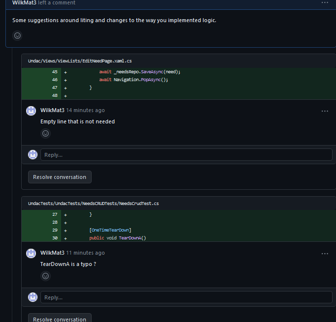
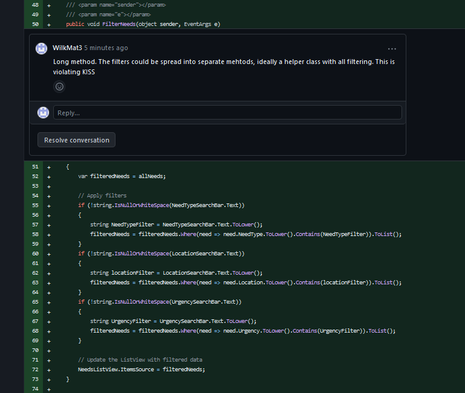
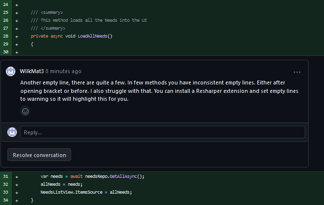
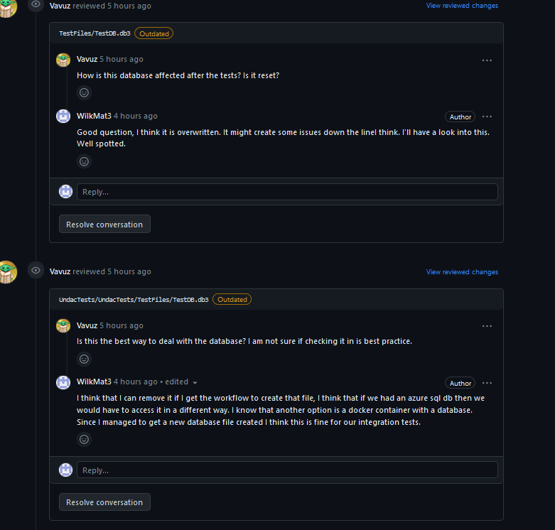
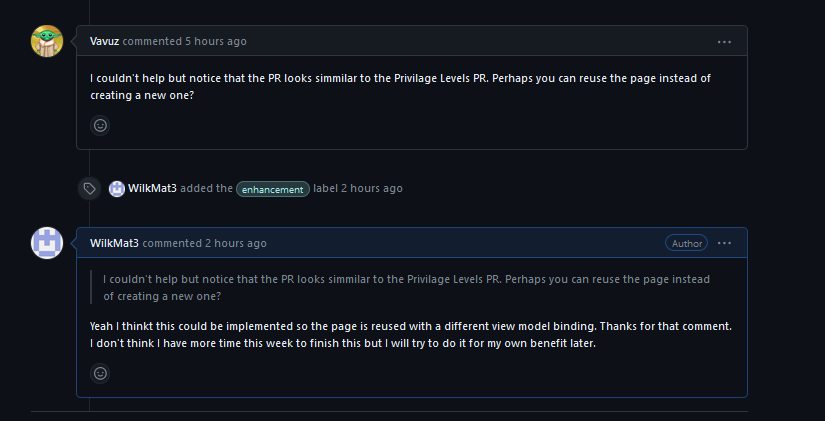

# Week 12 portfolio

## Summary 
This week I have worked on 2 tickets for my final portfolio. Firstly, I have implemented a CI pipeline for the whole project [Create CI workflow](https://github.com/xinjoonha/SET09102_PURPLE/pull/118). This is because we had multiple issues with testing in the past. I wanted to address some of the team workflow issues by giving more visibility to tests and builds. 
giving tests better visibility. I also wanted to learn more about creating a workflow script for a project and understand how the pipeline works. 

The other issue I worked on was about adding MVVM to the CRUD actions to Operations. I mainly did it so I could fix the the branch I was working on before. This was my first PR and I wanted to implement MVVM in this case as well [Adding MVVM to Organisations CRUD pages](https://github.com/xinjoonha/SET09102_PURPLE/pull/117)


### CI pipeline  
To create the CI pipeline I have selected the GitHub Actions and Selected dotnet workflow. This gave me the initial yaml file with the actual workflow. The only problem with that was that it was not adapted for MAUI. To understand the CI workflow and configure it for this project I had to do a fair bit of research. I encountered issues on a few different steps and found solutions resulting in the script below as per Figure 1. 

```
name: .NET MAUI CI

on:
  pull_request:

jobs:
  build-and-test:

    runs-on: windows-latest

    steps:
    - name: Checkout code
      uses: actions/checkout@v2

    - name: Setup .NET
      uses: actions/setup-dotnet@v2
      with:
        dotnet-version: 6.0.x

    - name: Set up JDK
      uses: actions/setup-java@v2
      with:
        distribution: 'adopt'
        java-version: '11'
        
    - name: Create TestFiles directory
      run: mkdir TestFiles

    - name: Generate SQLite Database
      run: $null > TestFiles/TestDB.db3

    - name: Install .NET MAUI Workload
      run: dotnet workload install maui

    - name: Restore dependencies
      run: dotnet restore

    - name: Build
      run: dotnet build --no-restore  
      
    - name: Test with the dotnet CLI
      run: dotnet test
```

*Figure 1 - workflow.yaml*

The final version triggers on every pull request and runs on Windows. I set up all dependencies in terms of MAUI .Net and Java that were required for the workflow to run. I even managed to create a database file so we do not need to check that in our repository. 

Some of the tests we have are integration tests, because we are using the database to get details I had to adapt our test project slightly to accommodate for workflow by adding a test base class. 


```
using Undac.Data;

namespace UndacTests
{
    public class TestBase
    {
        protected internal UndacDatabase Database { get; private set; }

        [OneTimeSetUp]
        public async Task OneTimeSetUpAsync()
        {
            // Create a test database file path within your unit test project
            string testDatabasePath = Path.Combine(Environment.GetEnvironmentVariable("GITHUB_WORKSPACE") ?? "", "TestFiles", "TestDB.db3");

            // Create an instance of UndacDatabase using the adjusted test database path
            Database = new UndacDatabase(testDatabasePath);
            await Database.Init();
        }
    }
}
```

*Figure 2 - Test base class *

The test base class initialises the database for some of our tests. Depending on the type of environment it will create a different path for the database as per Figure 2.

Figure 3 shows how Tests are inheriting the TestBase class. This removes code repetition as we had 3 classes that were initialising the database. 


```
    /// <summary>
    /// This class tests the CRUD functionalities for the team members
    /// </summary>
    [TestFixture]
    public class TeamMemberCrudTests : TestBase
    {
        private ITeamMemberRepository repo;

        [OneTimeSetUp]
        public async Task OneTimeSetUpAsync()
        {
            repo = new TeamMemberRepository(Database);
        }

```

*Figure 3 - Test base class *


### The MVVM

The code for implementing MVVM was very similar to what I did last week as this was also a ticket from week 3. I just wanted to implement MVVM for this feature. I reused the code from last week to do it, I did not fully complete this ticket as there was a comment that pointed me in the direction of using the same UI but different model binding.

```
using System.Collections.ObjectModel;
using CommunityToolkit.Mvvm.ComponentModel;
using CommunityToolkit.Mvvm.Input;
using Undac.Data.Repositories;
using Undac.Models;


namespace Undac.ViewModels
{
    /// <summary>
    /// View model with logic for the OrganisationsPage
    /// </summary>
    public partial class OrganisationsCrudViewModel : ObservableObject
    {
        IOrganisationRepository _repository;
        private Organisation _selectedOrganisation;

        [ObservableProperty] private ObservableCollection<Organisation> organisations;


        [ObservableProperty] private string _organisationName;

        /// <summary>
        /// Getter and setter for the _selectedOrganisation
        /// </summary>
        public Organisation SelectedOrganisation
        {
            get => _selectedOrganisation;
            set
            {
                SetProperty(ref _selectedOrganisation, value);
                UpdateItemCommand.NotifyCanExecuteChanged();
                DeleteItemCommand.NotifyCanExecuteChanged();
            }
        }

        /// <summary>
        /// Constructor for the OrganisationsCrudViewModel class
        /// </summary>
        /// <param name="repository">IOrganisationRepository used for CRUD operations</param>
        public OrganisationsCrudViewModel(IOrganisationRepository repository)
        {
            _repository = repository;
            LoadOrganisationsLevelsAsync();
        }

        /// <summary>
        /// This method loads all the organisations into the UI
        /// </summary>
        public async void LoadOrganisationsLevelsAsync()
        {
            var organisations = await _repository.GetAllAsync();
            Organisations = new ObservableCollection<Organisation>(organisations);
        }

        /// <summary>
        /// Creates an item based on the user input
        /// </summary>
        [RelayCommand]
        public async Task CreateItem()
        {
            string itemName = OrganisationName;
            if (!string.IsNullOrWhiteSpace(itemName))
            {
                Organisation newPrivilege = new Organisation
                {
                    Name = itemName,
                };
                var exists = await _repository.GetByNameAsync(itemName);
                if (exists == null)
                {
                    await _repository.SaveAsync(newPrivilege);
                    LoadOrganisationsLevelsAsync();
                }
            }
        }

        /// <summary>
        /// Updates an item based on the user input and selection
        /// </summary>
        [RelayCommand]
        public async Task UpdateItem()
        {
            if (!string.IsNullOrWhiteSpace(OrganisationName))
            {
                var exists = await _repository.GetByNameAsync(OrganisationName);
                if (exists == null)
                {
                    var editedOrganisation = await _repository.GetByNameAsync(SelectedOrganisation.Name);
                    editedOrganisation.Name = OrganisationName;
                    await _repository.SaveAsync(editedOrganisation);
                }
            }

            LoadOrganisationsLevelsAsync();
        }

        /// <summary>
        /// Deletes an item based on the user selection
        /// </summary>
        [RelayCommand]
        public async Task DeleteItem()
        {
            if (SelectedOrganisation != null)
            {
                var editedOrganisation = await _repository.GetByNameAsync(SelectedOrganisation.Name);

                await _repository.DeleteAsync(editedOrganisation);
                LoadOrganisationsLevelsAsync();
            }
        }
    }
}

```
*Figure 5- View Model*

The code follows exactly the same pattern as Privilege levels. This is probably also a hint that there could be a way of using this for all possible objects. But I did not have enough time to implement that. 

## Testing

### Pipeline set up 

I conducted manual testing for the CI pipeline, it took me around 70 attempts to get it to work and only a few more to address comments. Firstly, I struggled with MAUI dependencies but after doing some research I found the reason why the workflow was failing the runner had to be changed from Ubuntu to windows. The other part that was fairly difficult was accessing the database. Initially, I checked in the SQL lite database so that the workflow could access the file but finally, I got the script to create the file. 
The problem with manual testing is that the workflow errors are not very descriptive at times. For example, the dependencies were failing because of Tizen but the solution was to install all MAUI dependencies. 

### MVVM Tests
The tests for my implementation are the same as tests from last week I have not added anything new. This is partially because I think that my current implementation will have to be improved further and I just wanted to make sure that the feature works as it should. 
To be precise I started with tests first and then made sure that I implemented the UI that is passing, therefore I engaged in the TDD. This was easier as I knew what I need to do exactly for my View Model.

```
using Moq;
using System.Collections.ObjectModel;
using Undac.Data.Repositories;
using Undac.Models;
using Undac.ViewModels;

namespace UndacTests.UndacCRUDTests
{
    [TestFixture]
    public class OrganisationAdminTests : TestBase
    {
        Mock<IOrganisationRepository> repositoryMock;
        OrganisationsCrudViewModel viewModel;

        [SetUp]
        public void SetUp()
        {
            repositoryMock = new Mock<IOrganisationRepository>();
            viewModel = new OrganisationsCrudViewModel(repositoryMock.Object);
            repositoryMock.Setup(r => r.GetAllAsync()).ReturnsAsync(new List<Organisation> { new Organisation() });
        }

        [Test]
        public async Task Create_Item_When_Valid_Input_SaveAsync_Called()
        {
            repositoryMock.Setup(r => r.GetByNameAsync(It.IsAny<string>())).ReturnsAsync((Organisation)null);
            viewModel = new OrganisationsCrudViewModel(repositoryMock.Object);

            viewModel.OrganisationName = "NewPrivilege";
            await viewModel.CreateItem();

            repositoryMock.Verify(r => r.SaveAsync(It.IsAny<Organisation>()), Times.Once);
        }

        [Test]
        public async Task Update_Item_When_Valid_Input_SaveAsync_Called()
        {
            viewModel.Organisations = new ObservableCollection<Organisation>();
            viewModel.SelectedOrganisation = new Organisation() { Name = "ExistingName" };
            viewModel.OrganisationName = "ExistingName";
            repositoryMock.Setup(r => r.GetByNameAsync(viewModel.SelectedOrganisation.Name)).ReturnsAsync(viewModel.SelectedOrganisation);
            repositoryMock.Setup(r => r.GetByNameAsync(viewModel.OrganisationName)).ReturnsAsync(viewModel.SelectedOrganisation);

            viewModel.OrganisationName = "UpdatedName";
            await viewModel.UpdateItem();


            repositoryMock.Verify(r => r.SaveAsync(It.IsAny<Organisation>()), Times.Exactly(1));
        }

        [Test]
        public async Task CreateItemWhenDuplicateNameNoSaveAsyncCalled()
        {
            repositoryMock.Setup(r => r.GetByNameAsync(It.IsAny<string>())).ReturnsAsync(new Organisation());

            viewModel.OrganisationName = "ExistingName";
            await viewModel.CreateItem();

            repositoryMock.Verify(r => r.SaveAsync(It.IsAny<Organisation>()), Times.Never);
        }

        [Test]
        public async Task Update_Item_When_Invalid_Input_No_SaveAsync_Called()
        {
            repositoryMock.Setup(r => r.GetByNameAsync(It.IsAny<string>())).ReturnsAsync(new Organisation());
            viewModel.SelectedOrganisation = new Organisation() { Name = "ExistingName" };

            viewModel.OrganisationName = string.Empty;
            await viewModel.UpdateItem();

            repositoryMock.Verify(r => r.SaveAsync(It.IsAny<Organisation>()), Times.Never);
        }

        [Test]
        public async Task Update_Item_When_Duplicate_Name_No_SaveAsync_Called()
        {
            repositoryMock.Setup(r => r.GetByNameAsync(It.IsAny<string>())).ReturnsAsync(new Organisation());
            viewModel.SelectedOrganisation = new Organisation() { Name = "ExistingName" };

            viewModel.OrganisationName = "ExistingName";
            await viewModel.UpdateItem();

            repositoryMock.Verify(r => r.SaveAsync(It.IsAny<Organisation>()), Times.Never);
        }

        [Test]
        public async Task Delete_Item_When_Valid_Input_DeleteAsync_Called()
        {
            viewModel.SelectedOrganisation = new Organisation() { Name = "ExistingName" };

            await viewModel.DeleteItem();

            repositoryMock.Verify(r => r.DeleteAsync(It.IsAny<Organisation>()), Times.Once);
        }

        [Test]
        public async Task Delete_Item_When_Invalid_Input_No_DeleteAsync_Called()
        {
            viewModel.SelectedOrganisation = null;


            await viewModel.DeleteItem();


            repositoryMock.Verify(r => r.DeleteAsync(It.IsAny<Organisation>()), Times.Never);
        }
    }
}
```
*Figure 6 - Test class*

Again I have mocked the repository and checked how many times methods are called. 


## Leading a code review
This week I have reviewed [As an UNDAC Disaster Management Coordinator, I want to view a list of current needs so that I can make priority judgements](https://github.com/xinjoonha/SET09102_PURPLE/pull/112), this was a ticket implementing a CRUD and filtering functionalities. This PR has not implemented MVVM and it could use splitting some methods. I have found some code formatting issues that I highlighted along with a tool that I started using. 




*Figure 7 - code formatting*


In Figure 7 I highlighted a few small issues, the typo in the teardown method name and the issue with spacing.




*Figure 8 - long method*


In Figure 8 I left a comment regarding a method that could be potentially split into smaller methods. This is violating KISS, as there are 3 if statements with functionality for filtering. This particular code was not tested either. This did not surprise me as the MVVM was not implemented and the filtering was nested within the view. Ideally, I would like the MVVM to be implemented because it makes testing much easier and it separates concerns. Also filtering should be split into helper methods as this method violates the KISS rule.



*Figure 9 - advice*


I also left general advice regarding dealing with empty spaces. This PR had several instances of empty lines. I mentioned that I also struggle with this but I have found a solution by getting the code analyser to highlight this for me. 


## Getting my code reviewed 

I got two reviews for both of my PRs that gave me something to think about. Thanks to using the ReSharper and changing some rules so I get a warning on extra empty lines I avoided repeating my own mistakes. 




*Figure 10 - Comments for the CI PR*


In Figure 10 I have shown comments from my colleague regarding the workflow, the test database was checked into the repository. What I have not considered is how tests are going to affect the database. While I have not encountered any issues and tests were passing. It is at least a good practice to make sure that the tests have a consistent environment. This is why I have decided to have the database file created for the purpose of the CI pipline. 




*Figure 11 - CRUD PR comments*


Another great observation by my colleague as per Figure 11, was regarding usage of the same UI for all models and all CRUD operations. We should make it reusable. I thought about using the same page and just changing the binding context to a specific view model but I have not had time to complete this PR fully. 

### Code Before Changes 

```
name: .NET MAUI CI

on:
  pull_request:

jobs:
  build-and-test:

    runs-on: windows-latest

    steps:
    - name: Checkout code
      uses: actions/checkout@v2

    - name: Setup .NET
      uses: actions/setup-dotnet@v2
      with:
        dotnet-version: 6.0.x

    - name: Set up JDK
      uses: actions/setup-java@v2
      with:
        distribution: 'adopt'
        java-version: '11'

    - name: Install .NET MAUI Workload
      run: dotnet workload install maui

    - name: Restore dependencies
      run: dotnet restore

    - name: Build
      run: dotnet build --no-restore  

    - name: Test with the dotnet CLI
      run: dotnet test
```

*Figure 12 - Initial "good" workflow*

The fixed version can be viwed in Figure 1. 


## Reflections

### CI reflections 
Working on the Continous Integration pipeline was exciting. This is something that we should have started earlier on in the project as it would help us avoid so many issues with the main branch that we had two weeks ago. The main benefit is that anyone can see that the PR has passed tests and is building without an error just by looking at the workflow. There is no need to build all of this yourself. Moreover, if the PR is not passing tests or not building it would not be eligible for merge as all tests are not passing. 

### TDD attempt
This week I kind of had an opportunity to try the TDD while working on the MVVM ticket, I reappropriated the tests from last week first and started working on the view model and UI. I felt that implementing this feature was faster but I cannot tell if it was because I started from testing or is it because I knew what to do from start to finish. 

At the same time, I do not feel like this was a proper experience as this was not a completely new feature that had to be implemented from scratch. I think that this kind of situation forces a different perspective on creating tests. If you already know exactly how your code is going to look then I guess coming up with test cases is easier. I would need to try Test Driven Development a few more times to be able to tell if it is a suitable style for me. 

### Tools

I started using the ReSharper code analyser with my visual studio. This reduced extra empty lines in my code to 0. I have changed settings so that the line is highlighted when there is an empty line that should not be there. This is difficult to miss and thanks to that change I do not have to scan the code myself to find poor formatting in my code. This frees up my time and improves the quality of my code.


[Figure 7]: https://github.com/WilkMat3/SET09102_Personal_Portfolio/blob/main/images/Week12Reviewing1.png "Figure 7"

[Figure 8]: https://github.com/WilkMat3/SET09102_Personal_Portfolio/blob/main/images/Week12Reviewing2.png "Figure 8"

[Figure 9]: https://github.com/WilkMat3/SET09102_Personal_Portfolio/blob/main/images/Week12CIReview.png "Figure 9"

[Figure 10]: https://github.com/WilkMat3/SET09102_Personal_Portfolio/blob/main/images/Week12CIReview.png "Figure 10"

[Figure 11]: https://github.com/WilkMat3/SET09102_Personal_Portfolio/blob/main/images/Week12CrudReview.png "Figure 11"

[Figure 12]: https://github.com/WilkMat3/SET09102_Personal_Portfolio/blob/main/images/Week11MyCodeReview3.png "Figure 12"
