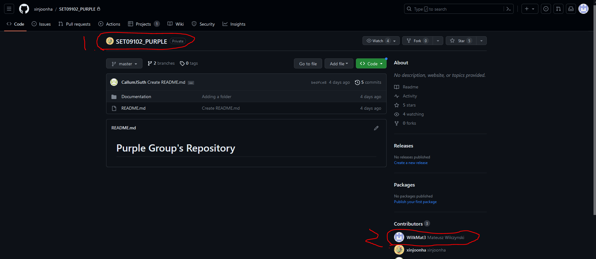
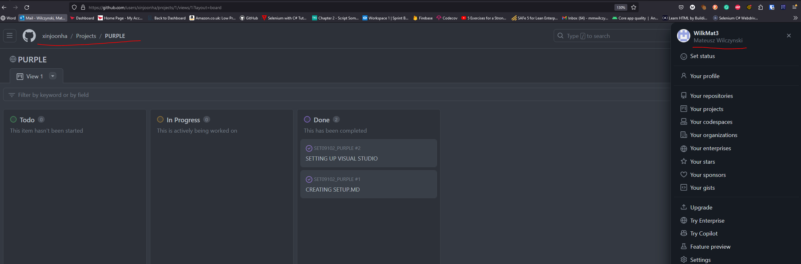
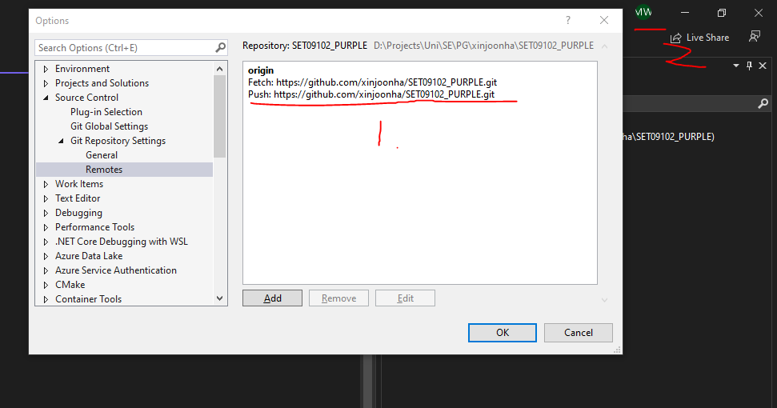
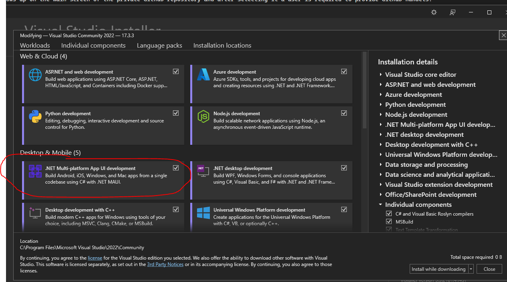
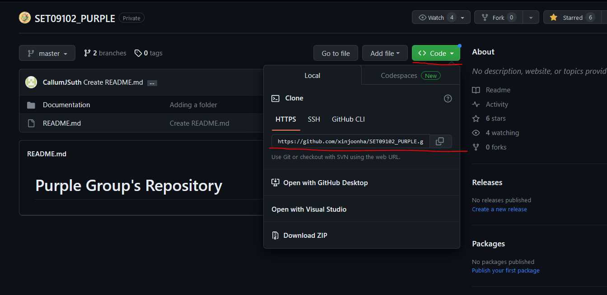
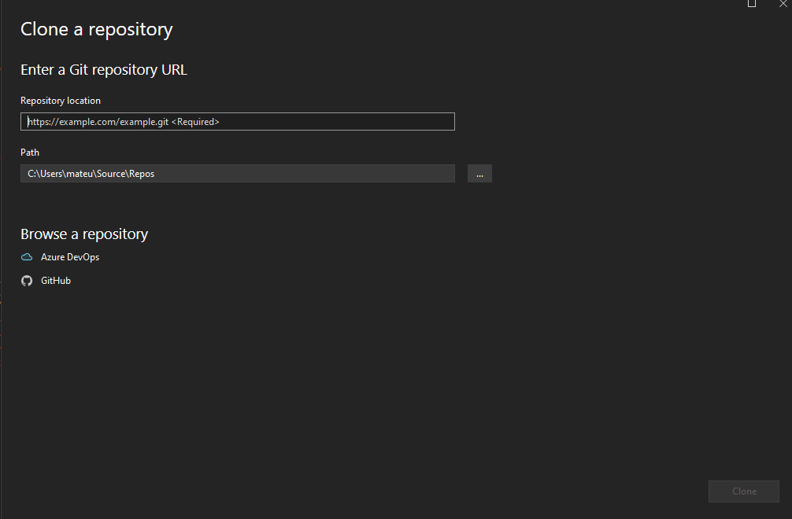

# Setup

## Environment configuration

This section describes my development environment set up for the Purple Group project.

### GitHub Shared Repository

*Caption: Screenshot of the main page of the group project repository*

On the [image 1][image1], I have highlighted in red the name of the repository (top left) and my name (bottom right) in the Contributors tab, thus confirming that I have access to the project's repository. Setting up the actual repository was not a difficult task. Any GitHub desktop user can click the "+" on the top right of the screen, which would open up options. After clicking on "create repository," a user needs to name the repository and optionally change other settings. After clicking "Create repository," the process is completed. In the case of our project, we have set the repository to private - we did not want anyone else to copy our work. Aside from that, the person responsible for creating the repository had to invite other users, which is also a trivial process. This option shows up on the main screen of the private GitHub repository, and after selecting it, a user is required to provide GitHub handles.

### GitHub Project Task Board

*Caption: Our project Task Board*

To track tasks and ensure better organization of the projects, we created a Project Task Board using GitHub Projects. On the [image 2][image2], the project name and my name were highlighted to confirm my access. Creating a Task Board was as simple as clicking "Projects" when on the Group Project repository website and linking a new project to the repository.

### Visual Studio Configuration

*Caption: Proof of my instance of VS code being linked to the GitHub repository*

On ![image 3][image3], I have highlighted the push and pull links for the group project, as well as an avatar with my initials, thus confirming that my Visual Studio was linked with our GitHub repository. In my case, the only required configuration was to clone the repository in Visual Studio. I am using VS 2022, and I had relevant MAUI packages installed.

*Caption: Configuration required for MAUI apps development*

To correctly set up Visual Studio 2022 for MAUI apps development, users have to select the MAUI package during installation, as highlighted on the [image 4][image4].

To clone the repository, users have to obtain the link for the repository from its GitHub page. This can be done by clicking the green "clone" button and copying the repository link, as highlighted on the [image 5][image5].

*Caption: Cloning GitHub repo by copying the link*

The next step requires opening Visual Studio, clicking File in the top right corner, and then clicking "Clone repository." Provided that the user is authenticated with GitHub, after pasting the link, the user can clone the repository, as per [image 6][image6].

*Caption: Visual Studio options for cloning a repository*

## Reflection

### Alternative Configurations

While our current environment is well-suited to our project, there are other options in terms of the choice of IDE, version control, and even the project board. Visual Studio 2022 is a great choice when developing MAUI apps because of support by Microsoft. The JetBrains Rider IDE also supports MAUI app development. We could also change GitHub to Azure DevOps for version control; both allow for creating workflows and are quite similar. When it comes to the project board, GitHub Projects is the best choice, but there are other alternatives like Jira or Trello. Github projects allows us to link tasks to pull requests and add extra descriptions and labels to each ticket. It does that without the need to pay extra. Moreover, the vast majority of agile project management platforms limit the number of contributors on the free tier, which makes them unusable in our case.

### Challenges

While the process of setting up the development environment was trivial, we have discovered that some people in our group are not used to GitHub or have no experience using Visual Studio. To help each other, we have set up a communication channel on Discord where we can share our issues and ideas. This will be especially helpful in the future when we are dealing with more complicated tasks.

---

[image1]: ./images/Repository_My_access_Github.PNG "Screenshot of the main page of the group project repository"
[image2]: ./images/github_project_task_board.PNG "Our project Task Board"
[image3]: ./images/vs_cloned.PNG "Proof of my instance of VS code being linked to the GitHub repository"
[image4]: ./images/MAUI.PNG "Configuration required for MAUI apps development"
[image5]: ./images/LinkingRepository.PNG "Cloning GitHub repo by copying the link"
[image6]: ./images/VS_repository.PNG "Visual Studio options for cloning a repository"
