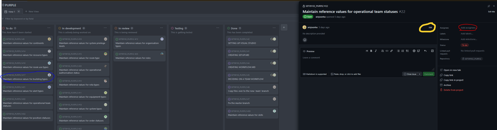

# Workflow

## Task workflow

### Our Task Workflow 
We have decided to create a workflow that will divide the process into 7 stages as on the [Figure 1].  In this section I describe the steps I took to complete the development work using our workflow. 

*Figure 1: Team workflow with description of each step*

### Accepting a task 

My first task was to accept a ticket from the board, to do that I have clicked on the issue within our Kanaban board as highlighted in blue on the [Figure 2]

*Figure 2: Tasks in "To do " column on the Kanban board and a Task Details Page* 

This action opens details page of the task, to assign a task to myself I had to click assign as highlighted in red on the the [Figure 2]. 
### Creating Feature Branch

I created a feature branch as per the flow. This is a common practice that works with creating pull requests, which help with reviewing the commited code. 
To create a branch based on main in Visual Studio I have opened Visual Studio and from the top menu selected "git" then "new branch". This opened a pop up as on the [Figure 3] which allowed me to specify the branch name and reuse the code of the main branch. 

*Figure 3: Branch creation popup in Visual Studio* 

### Updating task information
I have updated the task description on the details page to give more information about what my ticket entails. To complete that I clicked the "edit" text as can be seen on higlighted in yellow on the [Figure 2]. 
The updated description of my task can be seen on the [Figure 4]. 

*Figure 4: Ticket with added description and acceptance criteria* 

### Developing soulution 
My task was maintain reference values for organisation types - after refining the ticket and discussing what exactly needs to be done I narrowed down the requirements to allowing users to create, delete, update and view the organisation within the UI. To prepare for this task I have watch several tutorial videos on MAUI app development, this gave me a good base when working on the solution. I have encountered some issues with xaml markup specifically with binding data but thanks to resources such as stack overflow and Microsoft documentation I was able to find solutions to my problems.During my developement I commited changes to my branch and gave each commit a meaningful title as per [Figure 5] After thorough manual tests of my application and check with Definition of Done(https://github.com/xinjoonha/SET09102_PURPLE/blob/main/Documentation/DoD)  I was happy to progress the task from In Progress to In Review. 

*Figure 5: History of commits for my branch* 

### Updating Task Board 
Updating the task board was an easy process this can be done in few ways but the easiest is to drag and drop an item to a desired column, as I have done with my ticket. Another way of doing it is updating "status" in the ticket details which can be seen on the right side of the [Figure 2]. I only moved my ticket from "To do" column to "In Development" when I assigned the task and started working on it. Once my code fulfilled acceptance criteria and the Definition of Donethen I moved my task to "In Review" column(which can aslo be seen on the [Figure 2]). Tasks move between columns as the development process progresses. If during review an issues is found withing the code the task moves back to in progress and the process repeats. Our finall column before Done is Testing which is dedicated to the manual testing of the application, during that time defects could be found that would send the ticket back to the in progress column. 

### Making a pull request
Once I completed my work on the feature branch I have created the pull request to facilitate the discussion on the code I created. To create a pull request(PR) I have clicked Pull requests from the repositorty github page, marked in blue on the [Figure 6] and then I clicked "new pull request" marked in red.

*Figure 6: Creating a pull request part one* 

After that I was presented with a screen where I could select which branches would be considered in pull request as per the example in [Figure 7]. Our policy dictates that the feature branches are merged into the main. I have selected branches so that my feature branch merges into master once the PR is completed. 

*Figure 7: Branch selection screen for pull requests* 

After creating the pull request I was presented with a screen that allowed me to add description of changes as per the [Figure 8]. This is also the page where the discussion about my work happens. This is where my branch awaited comments and approvals and based on those the ticket will flow in either direction.

*Figure 8: Pull request view* 

## Reflection

### Challenges
Technology changes all the time and some information that I have obtained in tutorials was outdated which resulted in more time spend debugging issues and finding solutions. No one in my group has expirence with MAUI and I could not find help easily. To combat that I should spend more time researching MAUI application development and spend more time reading documentation. 

I have found that the Visual studio does not have built in viewer for the SQL Lite database but after some research I found an extension that allowed me to view changes to the database while running the application. I have shared that with the team to aid them in the development proccess.

The code I created is not well suited for unit testing and according to best practice it should be the integration testing that checks CRUD methods on the database. I still have to fully explore integration testing to be able to do it correctly and according to best practice. 

### Possible improvements

The process we currently have is good but we have not refined tickets as a team. We accepted the issues the way they were but no looked into each ticket to decide if the given description is accurate. This is something that we should consider doing at least in a smaller group in order to define the necessary work better.

I have realised that my commit comments could be more descriptive. This could help the team to figure out when and what changes were made whenever a revert is needed. I could also see the point of commiting more often. 

### Postives

The task board set up seems straightforward and it allow for some manual sanity testing before the pull request is completed. We decided that each PR needs at least 3 approvals which should in theory increase chances of finding bugs within the code and improve the quality of software. 

[Figure 1]: ./images/Workflow.PNG "Figure 1"
[Figure 2]: ./images/Assing.PNG "Figure 2"
[Figure 3]: ./images/BranchCreation.PNG "Figure 3"
[Figure 4]: ./images/Updated_Ticket.PNG "Figure 4"
[Figure 5]: ./images/CommitsHistory.PNG "Figure 5"
[Figure 6]: ./images/prCreation.PNG "Figure 6"
[Figure 7]: ./images/prCreation2.PNG "Figure 7"
[Figure 8]: ./images/PR.PNG "Figure 8"