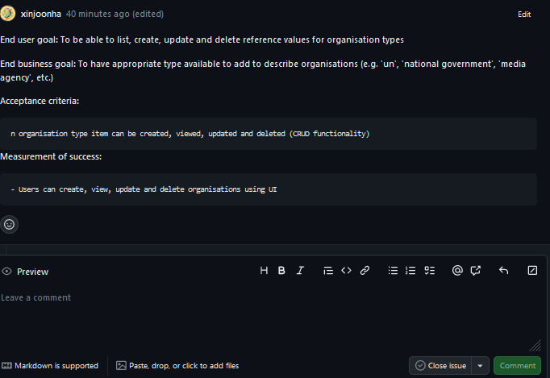

# Workflow

## Task workflow

### Our Task Workflow 

We have decided to create a workflow that will divide the process into 7 stages, as on the [Figure 1](https://github.com/WilkMat3/SET09102_Personal_Portfolio/blob/main/images/Workflow.PNG ).  In this section, I describe steps I took to complete the development work using our workflow. 

*Figure 1: Team workflow with description of each step*

### Accepting a task 

My first task was to accept a ticket from the board to do that, I clicked on the issue within our Kanaban board, as highlighted in blue on the [Figure 2]

*Figure 2: Tasks in "To do " column on the Kanban board and a Task Details Page* 

This action opens the details page of the task to assign a task to myself. I had to click "assign", as highlighted in red on the [Figure 2] and select my account from the dropdown list. 

### Creating Feature Branch

As part of our standard workflow, I followed the common practice of creating a feature branch, which is useful in facilitating the code review process through pull requests.
To create the feature branch, I initiated the process in Visual Studio. I navigated to the 'git' menu at the top and selected the 'new branch' option. This action triggered a pop-up window, as shown in [Figure 3]. Within this window, I had the opportunity to define the branch name and choose to base it on the existing code from the main branch. This approach allowed for a clean and organized development process.

*Figure 3: Branch creation popup in Visual Studio* 

### Updating task information

I updated the task description on the details page to provide more accurate information about my ticket. To achieve this, I simply clicked on the 'edit' option, which is highlighted in yellow in [Figure 2].
The updated description of my task can be seen on the [Figure 4]. 

*Figure 4: Ticket with added description and acceptance criteria* 

### Developing soulution 

My task was to maintain reference values for organisation types. After refining the ticket and discussing my task, I narrowed down the requirements to allow users to create, delete, update and view the organisation within the UI. 
To prepare for this task, I proactively studied several tutorial videos on MAUI app development. This foundational knowledge proved invaluable as I began working on the solution. During the development process, I encountered some challenges with XAML markup, particularly related to data binding. Fortunately, I leveraged external resources such as Stack Overflow and official Microsoft documentation to find effective solutions to these issues.
Throughout my development work, I diligently committed changes to my branch, providing each commit with a meaningful and descriptive title, as shown in the [Figure 5].
After completing the coding phase, I thoroughly tested my application.  
Then I revisited the Definition of Done([DoD][https://github.com/xinjoonha/SET09102_PURPLE/blob/main/Documentation/DoD]) to ensure that all criteria were met. Only after I progressed the task to the In Review Column.

*Figure 5: History of commits for my branch* 

### Updating Task Board 

Updating the task board is a straightforward process, offering multiple methods to achieve the desired results. Among these methods, the simplest involves a quick drag-and-drop action to relocate an item to the desired column, as I have done when working on my ticket. Alternatively, you can update the 'status' within the ticket details, which is located on the right side of [Figure 2] within ticket details.

I moved my ticket from the 'To Do' column to 'In Development' when I took ownership of the task and started work. After completing the code, ensuring it met the acceptance criteria and the Definition of Done, I moved my task to the 'In Review' column, a step also visible in [Figure 2].

The movement of tasks across columns reflects the progression of the development process. If any issues are identified during the code review, the task is returned to the 'In Progress' column, initiating a repeat of the process. Our final column before reaching 'Done' is 'Testing,' dedicated to manual testing of the application. During this phase, any defects detected may prompt the return of the ticket to the 'In Progress' column for further development.

### Making a pull request

Once I completed my work on the feature branch, I created the pull request to facilitate the discussion on the code I created. To create a pull request(PR), I clicked Pull requests from the repository GitHub page, marked in blue on the [Figure 6], and then I clicked "new pull request" marked in red.

*Figure 6: Creating a pull request part one* 

After that, I was presented with a screen where I could select which branches would be considered for the PR as per the example in [Figure 7]. Our policy dictates that the feature branches are merged into the main. I have selected branches so that my feature branch merges into the master once the PR is completed.  

*Figure 7: Branch selection screen for pull requests* 

After creating the PR, I was presented with a screen that allowed me to add description of changes as per the [Figure 8]. This is also the page where the discussion about my work happens and  where my branch awaited comments and approvals.

*Figure 8: Pull request view* 

## Reflection

### Challenges

Technology changes all the time and some information that I have obtained in tutorials was outdated which resulted in more time spent debugging issues and finding solutions. No one in my group has experience with MAUI and I could not find help easily. To combat that I should spend more time researching MAUI application development and spend more time reading documentation. 

I have found that the Visual Studio does not have a built-in viewer for the SQL Lite database but after some research, I found an extension that allowed me to view changes to the database while running the application. I have shared that with the team to aid them in the development process.

The code I created is not well suited for unit testing and according to best practice, it should be the integration testing that checks CRUD methods on the database. I still have to fully explore integration testing to be able to implement it correctly. 

### Possible improvements

The process we currently have is adequate, but we have not refined tickets as a team. We accepted the issues the way they were but did not look into each ticket to decide if the given description was accurate. This is something that we should consider doing at least in a smaller group in order to define the necessary work better.

I have realised that my commit comments could be more descriptive. This could help the team figure out when and what changes were made whenever a revert is needed. I could also see the point of committing more often as it is useful to be able to revert code in small batches. 

### Strengths

The task board set-up seems straightforward and accomodates quality assurance work before the pull request is completed. We decided that each PR needs at least 3 approvals which should increase the chances of finding bugs within the code and improve the quality of software.

[Figure 1]: https://github.com/WilkMat3/SET09102_Personal_Portfolio/blob/main/images/Workflow.PNG "Figure 1"

[Figure 2]: https://github.com/WilkMat3/SET09102_Personal_Portfolio/blob/main/images/Assign.PNG "Figure 2"

[Figure 3]: https://github.com/WilkMat3/SET09102_Personal_Portfolio/blob/main/images/BranchCreation.PNG "Figure 3"

[Figure 4]: https://github.com/WilkMat3/SET09102_Personal_Portfolio/blob/main/images/Updated_Ticket.PNG "Figure 4"

[Figure 5]: https://github.com/WilkMat3/SET09102_Personal_Portfolio/blob/main/images/CommitsHistory.PNG "Figure 5"

[Figure 6]: https://github.com/WilkMat3/SET09102_Personal_Portfolio/blob/main/images/prCreation.PNG "Figure 6"

[Figure 7]: https://github.com/WilkMat3/SET09102_Personal_Portfolio/blob/main/images/prCreation2.PNG "Figure 7"

[Figure 8]: https://github.com/WilkMat3/SET09102_Personal_Portfolio/blob/main/images/PR.PNG "Figure 8"
