# Documentation

This section is related to your work on clean code and documentation in week 5.

First, choose six rules of clean code and explain them. For each one,

* Summarise the rule in your own words.
* Provide an example from the code that you wrote in week 2 and then refined in week 4.
* Explain how your code implements the rule. 

Second, copy the doxygen comments from your code into your portfolio and provide some 
descriptive commentary on their purpose and structure. Use screenshots showing the HTML 
content that is generated from your code to illustrate your explanation.

Finally, highlight three examples from your code where you have eliminated the need
for comments by adhering to the principles of clean code.
 

## Naming Conventions
### Overview
Naming in programming is extremely important. Understandably, descriptive and relevant names allow us to understand what a particular variable, method or class represents. Martin(2010) in his book writes that the code should read like a poem. There are a few principles regarding naming that help improve how the code reads and reduce the need for comments. While certain rules might differ between languages, several principles are universal to all languages. Below I have listed a few important naming conventions:

--A name should reveal an intention - this helps us to understand the code much better as it can give an idea of what a particular code represents 

--Class names should consist of nouns or noun phrases - a class is a representation of an object, not an action

--Method names should consist of verbs or verb phrases - methods and functions represent some kind of action that is being performed, thus verb is a better option for describing a method

Moreover, C# has its naming conventions. For example, the usage of Pascal Case for classes and methods names or camelCase for local variables, method arguments and private fields names. 

### Code before 
<a name="Figure_1"></a>
```
using Undac.Models;

namespace Undac.Views.Admin;

public partial class OrganisationEditPage : ContentPage
{
        private Organisation EditingOrganisation;

        public OrganisationEditPage(Organisation organisation)
        {
            InitializeComponent();
            EditingOrganisation = organisation;
            NameEntry.Text = organisation.Name;
        }

       private async void SaveButton_Clicked(object sender, EventArgs e)
    {


        string Name1 = NameEntry.Text?.Trim(); // Trim leading/trailing whitespace
        if (string.IsNullOrEmpty(Name1))
        {
            await DisplayAlert("Error", "Organization name cannot be empty.", "OK");
            return; // Do not save if the input name is empty name is empty
        }
        else if (!string.Equals(Name1, EditingOrganisation.Name, StringComparison.OrdinalIgnoreCase))
        {
            // Check if an organization with the same name already exists in the database
            var org = await App.Database.GetOrganisationAsync(Name1);
            if (org != null)
            {
                await DisplayAlert("Error", "An organization with the same name already exists.", "OK");
                return; // Do not save if a duplicate organization name is found
            }
            else
            {
                await App.Database.DeleteOrganisationAsync(EditingOrganisation);
                // Update the properties of the EditingOrganisation
                EditingOrganisation.Name = Name1;
                await App.Database.SaveOrganisationAsync(EditingOrganisation); // Update in the database
                                                                               // Navigate back to the OrganisationPage after saving
                await Navigation.PopAsync();
            }
        

        }


    }

    private async void CancelButton_Clicked(object sender, EventArgs e)
        {
            // Navigate back to the OrganisationPage without saving
            await Navigation.PopAsync();
        }
}

```
*Figure 1: Edit Page - code fromw week 3* 


### Code after

```
using Undac.Models;

namespace Undac.Views.Admin;

public partial class OrganisationEditPage : ContentPage
{
    private Organisation EditedOrganisation;

    public OrganisationEditPage(Organisation organisation)
    {
        InitializeComponent();
        EditedOrganisation = organisation;
        NameEntry.Text = organisation.Name;
    }

    private async void SaveButton_Clicked(object sender, EventArgs e)
    {


        string inputName = NameEntry.Text?.Trim(); // Trim leading/trailing whitespace
        if (string.IsNullOrEmpty(inputName))
        {
            await DisplayAlert("Error", "Organization name cannot be empty.", "OK");
            return; // Do not save if the input name is empty name is empty
        }
        else if (!string.Equals(inputName, EditedOrganisation.Name, StringComparison.OrdinalIgnoreCase))
        {
            // Check if an organization with the same name already exists in the database
            var organisationWithinDatabase = await App.Database.GetOrganisationAsync(inputName);
            if (organisationWithinDatabase != null)
            {
                await DisplayAlert("Error", "An organization with the same name already exists.", "OK");
                return; // Do not save if a duplicate organization name is found
            }
            else
            {
                await App.Database.DeleteOrganisationAsync(EditedOrganisation);
                // Update the properties of the EditingOrganisation
                EditedOrganisation.Name = inputName;
                await App.Database.SaveOrganisationAsync(EditedOrganisation); // Update in the database
                                                                               // Navigate back to the OrganisationPage after saving
                await Navigation.PopAsync();
            }


        }


    }

    private async void CancelButton_Clicked(object sender, EventArgs e)
    {
        // Navigate back to the OrganisationPage without saving
        await Navigation.PopAsync();
    }
}
```
*Figure 2: Edit Page - code from week 5 after naming refactor* 
<a name="Figure_2"></a>

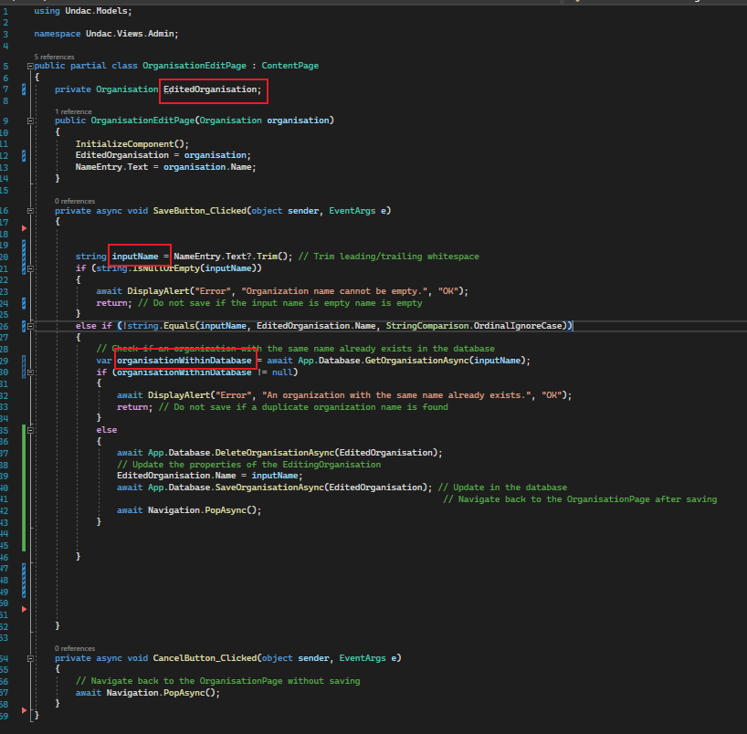

*Figure 3: Edit Page - screenshot from week 5 after naming refactor* 

### Explanation

Considering just the naming conventions for the code in Figure 1, I can see that three variables are violating naming conventions. On the [Figure 3] I have highlighted the changes I made. 
Starting from the top following changes were made:

*EditingOrganisation* to *EditedOrganisation* - Editing part of the name was not making much sense and changing to Edited makes it more readable.

the *Name1*  was changed to *inputName* - the initial naming was too general and not written in camelCase as all local variables should be.

Lastly, I have changed the *org* to *organisationWithinDatabase* to better describe what exactly this variable represents 


## Formatting - Vertical formatting rules
### Overview
Vertical formatting rules are designed to make code easier to understand and read. Vertical formatting considers white space between lines. More than one white line is considered a violation of this rule. 
One line gap is permissible, and it is encouraged in order to separate concepts. 
Overall, well-spaced code is more readable. 

### Example
```
using Undac.Models;

namespace Undac.Views.Admin;

public partial class OrganisationEditPage : ContentPage
{
    private Organisation EditedOrganisation;

    public OrganisationEditPage(Organisation organisation)
    {
        InitializeComponent();
        EditedOrganisation = organisation;
        NameEntry.Text = organisation.Name;
    }

    private async void SaveButton_Clicked(object sender, EventArgs e)
    {


        string inputName = NameEntry.Text?.Trim(); // Trim leading/trailing whitespace
        if (string.IsNullOrEmpty(inputName))
        {
            await DisplayAlert("Error", "Organization name cannot be empty.", "OK");
            return; // Do not save if the input name is empty name is empty
        }
        else if (!string.Equals(inputName, EditedOrganisation.Name, StringComparison.OrdinalIgnoreCase))
        {
            // Check if an organization with the same name already exists in the database
            var organisationWithinDatabase = await App.Database.GetOrganisationAsync(inputName);
            if (organisationWithinDatabase != null)
            {
                await DisplayAlert("Error", "An organization with the same name already exists.", "OK");
                return; // Do not save if a duplicate organization name is found
            }
            else
            {
                await App.Database.DeleteOrganisationAsync(EditedOrganisation);
                // Update the properties of the EditingOrganisation
                EditedOrganisation.Name = inputName;
                await App.Database.SaveOrganisationAsync(EditedOrganisation); // Update in the database
                                                                               // Navigate back to the OrganisationPage after saving
                await Navigation.PopAsync();
            }


        }


    }

    private async void CancelButton_Clicked(object sender, EventArgs e)
    {
        // Navigate back to the OrganisationPage without saving
        await Navigation.PopAsync();
    }
}
```
*Figure 4: Edit Page - code before vertical spacing refactor* 
<a name="Figure_4"></a>

### Code after
<a name="Figure_5"></a>
```
using Undac.Models;

namespace Undac.Views.Admin;

public partial class OrganisationEditPage : ContentPage
{
    private Organisation EditedOrganisation;

    public OrganisationEditPage(Organisation organisation)
    {
        InitializeComponent();
        EditedOrganisation = organisation;
        NameEntry.Text = organisation.Name;
    }

    private async void SaveButton_Clicked(object sender, EventArgs e)
    {
        string inputName = NameEntry.Text?.Trim(); // Trim leading/trailing whitespace

        if (string.IsNullOrEmpty(inputName))
        {
            await DisplayAlert("Error", "Organization name cannot be empty.", "OK");
            return; // Do not save if the input name is empty name is empty
        }
        else if (!string.Equals(inputName, EditedOrganisation.Name, StringComparison.OrdinalIgnoreCase))
        {
            // Check if an organization with the same name already exists in the database
            var organisationWithinDatabase = await App.Database.GetOrganisationAsync(inputName);

            if (organisationWithinDatabase != null)
            {
                await DisplayAlert("Error", "An organization with the same name already exists.", "OK");
                return; // Do not save if a duplicate organization name is found
            }
            else
            {
                await App.Database.DeleteOrganisationAsync(EditedOrganisation);
                // Update the properties of the EditingOrganisation
                EditedOrganisation.Name = inputName;

                await App.Database.SaveOrganisationAsync(EditedOrganisation); // Update in the database
                                                                               // Navigate back to the OrganisationPage after saving
                await Navigation.PopAsync();
            }
        }
    }

    private async void CancelButton_Clicked(object sender, EventArgs e)
    {
        // Navigate back to the OrganisationPage without saving
        await Navigation.PopAsync();
    }
}
```
*Figure 5: Edit Page - code from week 5 after vertical spacing refactor* 
<a name="Figure_5"></a>

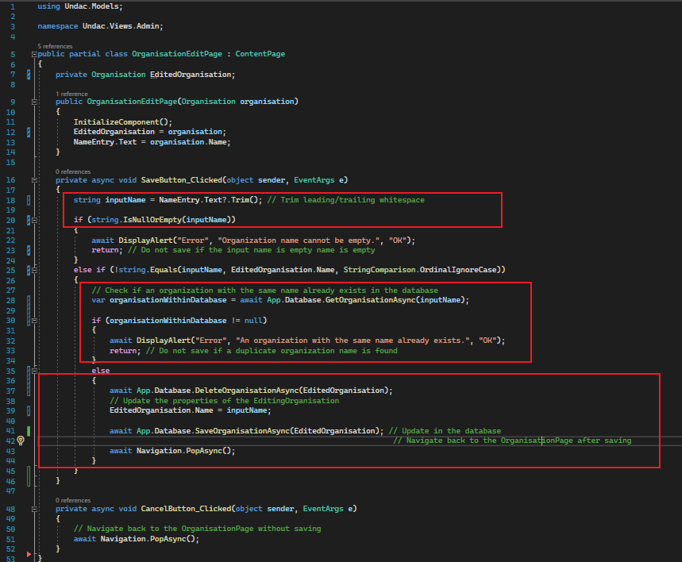

*Figure 6: Edit Page - screenshot from week 5 after spacing refactor* 

### Explanation

Initially, I removed all of the white lines. This allows for easier track of encapsulation and makes the class smaller, thus making it more redable

I have also separated some logic with a single empty line as per highlighted sections on the [Figure 6]. This allowed me to keep related logic together and separate lines that perform different roles. 


## Comments
### Overview
Microsoft provides a guide regarding how comments should be formatted and styled. If a comment is required then it should be started with *//*. A space should be made after the initial *//* and a comment should be placed on a separate line. Aside from that they should start with a capital letter and end with a dot. 

Martin(2010) writes that comments do not make up bad code and that it is advisable to create code that is clear enough to explain itself. This can be done through selecting appropriate names for variables and by organising the code.
On the other hand there could be valid reasons to include comments in the code. Such as amplyfing a message about a line of code that seems not too important or a warning agains a code that takes a long time to run.

### Example
```
using Undac.Models;

namespace Undac.Views.Admin;

public partial class OrganisationEditPage : ContentPage
{
    private Organisation EditedOrganisation;

    public OrganisationEditPage(Organisation organisation)
    {
        InitializeComponent();
        EditedOrganisation = organisation;
        NameEntry.Text = organisation.Name;
    }

    private async void SaveButton_Clicked(object sender, EventArgs e)
    {
        string inputName = NameEntry.Text?.Trim(); // Trim leading/trailing whitespace

        if (string.IsNullOrEmpty(inputName))
        {
            await DisplayAlert("Error", "Organization name cannot be empty.", "OK");
            return; // Do not save if the input name is empty name is empty
        }
        else if (!string.Equals(inputName, EditedOrganisation.Name, StringComparison.OrdinalIgnoreCase))
        {
            // Check if an organization with the same name already exists in the database
            var organisationWithinDatabase = await App.Database.GetOrganisationAsync(inputName);

            if (organisationWithinDatabase != null)
            {
                await DisplayAlert("Error", "An organization with the same name already exists.", "OK");
                return; // Do not save if a duplicate organization name is found
            }
            else
            {
                await App.Database.DeleteOrganisationAsync(EditedOrganisation);
                // Update the properties of the EditingOrganisation
                EditedOrganisation.Name = inputName;

                await App.Database.SaveOrganisationAsync(EditedOrganisation); // Update in the database
                                                                               // Navigate back to the OrganisationPage after saving
                await Navigation.PopAsync();
            }
        }
    }

    private async void CancelButton_Clicked(object sender, EventArgs e)
    {
        // Navigate back to the OrganisationPage without saving
        await Navigation.PopAsync();
    }
}
```
*Figure 7: Edit Page - code before comments changes* 
<a name="Figure_7"></a>

### Code after
```
using Undac.Models;

namespace Undac.Views.Admin;

public partial class OrganisationEditPage : ContentPage
{
    private Organisation EditedOrganisation;

    public OrganisationEditPage(Organisation organisation)
    {
        InitializeComponent();
        EditedOrganisation = organisation;
        NameEntry.Text = organisation.Name;
    }

    private async void SaveButton_Clicked(object sender, EventArgs e)
    {
        // This trim is importatnt as it prevents ilogical entries to the database. 
        string inputName = NameEntry.Text?.Trim();

        if (string.IsNullOrEmpty(inputName))
        {
            await DisplayAlert("Error", "Organization name cannot be empty.", "OK");
            return;
        }
        else if (!string.Equals(inputName, EditedOrganisation.Name, StringComparison.OrdinalIgnoreCase))
        {

            var organisationWithinDatabase = await App.Database.GetOrganisationAsync(inputName);

            if (organisationWithinDatabase != null)
            {
                await DisplayAlert("Error", "An organization with the same name already exists.", "OK");
                return; 
            }
            else
            {
                await App.Database.DeleteOrganisationAsync(EditedOrganisation);

                EditedOrganisation.Name = inputName;

                await App.Database.SaveOrganisationAsync(EditedOrganisation);

                await Navigation.PopAsync();
            }
        }
    }

    private async void CancelButton_Clicked(object sender, EventArgs e)
    {
        await Navigation.PopAsync();
    }
}
```
*Figure 8: Edit Page - code from week 5 after comments changes* 
<a name="Figure_8"></a>

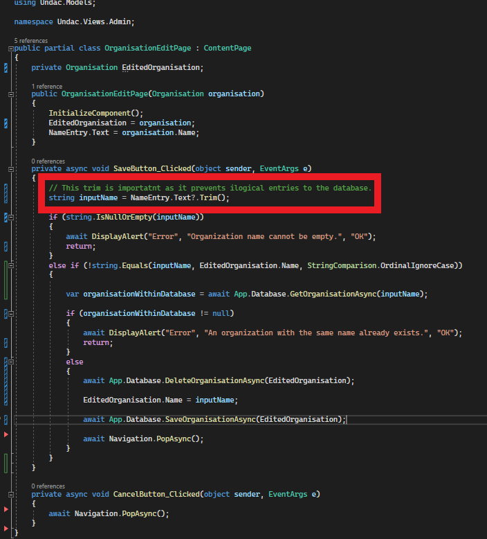

*Figure 9: Edit Page - code from week 5 after comments changes* 

### Explanation
I have decided to remove all comments but one. As highlighted on the [Figure 9], I have moved a comment to a separate line and changed it, so it amplifies why this line is so important. 
The rest of the comments were removed as they do not provide any value. Changes to the naming of variables and removing the whitespace made this class more readable than before and obvious comments are not required. 


## KISS
### Overview
KISS or Keep It Simple Stupid refers to the importance of code simplicity. The code should be easy to understand for it to be easier to maintain, debug and expand. More complicated code can take significantly longer to debug which increases the cost of the project/task.

### Example
```
using Undac.Models;

namespace Undac.Views.Admin;

public partial class OrganisationEditPage : ContentPage
{
    private Organisation EditedOrganisation;

    public OrganisationEditPage(Organisation organisation)
    {
        InitializeComponent();
        EditedOrganisation = organisation;
        NameEntry.Text = organisation.Name;
    }

    private async void SaveButton_Clicked(object sender, EventArgs e)
    {
        // This trim is importatnt as it prevents ilogical entries to the database. 
        string inputName = NameEntry.Text?.Trim();

        if (string.IsNullOrEmpty(inputName))
        {
            await DisplayAlert("Error", "Organization name cannot be empty.", "OK");
            return;
        }
        else if (!string.Equals(inputName, EditedOrganisation.Name, StringComparison.OrdinalIgnoreCase))
        {

            var organisationWithinDatabase = await App.Database.GetOrganisationAsync(inputName);

            if (organisationWithinDatabase != null)
            {
                await DisplayAlert("Error", "An organization with the same name already exists.", "OK");
                return; 
            }
            else
            {
                await App.Database.DeleteOrganisationAsync(EditedOrganisation);

                EditedOrganisation.Name = inputName;

                await App.Database.SaveOrganisationAsync(EditedOrganisation);

                await Navigation.PopAsync();
            }
        }
    }

    private async void CancelButton_Clicked(object sender, EventArgs e)
    {
        await Navigation.PopAsync();
    }
}
```
*Figure 10: Edit Page - before KISS refactor* 
<a name="Figure_10"></a>

### Code after
<a name="Figure_11"></a>
```
using Undac.Models;

namespace Undac.Views.Admin;

public partial class OrganisationEditPage : ContentPage
{
        private Organisation EditedOrganisation;

        public OrganisationEditPage(Organisation organisation)
        {
            InitializeComponent();
            EditedOrganisation = organisation;
            NameEntry.Text = organisation.Name;
        }

    private async void SaveButton_Clicked(object sender, EventArgs e)
    {
        // This trim is importatnt as it prevents ilogical entries to the database. 
        string inputName = NameEntry.Text?.Trim(); 

        if (string.IsNullOrEmpty(inputName))
        {
            await DisplayAlert("Error", "Organization name cannot be empty.", "OK");
            return; 
        }

        if (!string.Equals(inputName, EditedOrganisation.Name, StringComparison.OrdinalIgnoreCase))
        {
            var existingOrganization = await App.Database.GetOrganisationAsync(inputName);
            if (existingOrganization != null)
            {
                await DisplayAlert("Error", "An organization with the same name already exists.", "OK");
                return; 
            }
        }

        await App.Database.DeleteOrganisationAsync(EditedOrganisation);

        EditedOrganisation.Name = inputName;

        await App.Database.SaveOrganisationAsync(EditedOrganisation);

        await Navigation.PopAsync();
    }

    private async void CancelButton_Clicked(object sender, EventArgs e)
        {
            await Navigation.PopAsync();
        }
}

```
*Figure 11: Edit Page - after KISS refactor* 

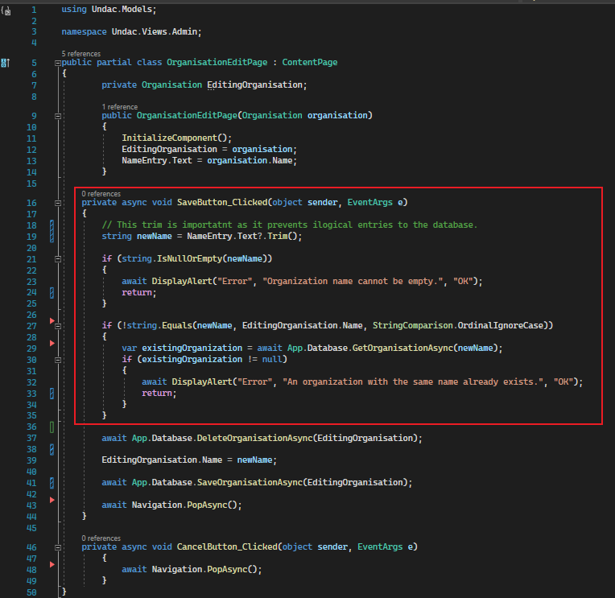

*Figure 12: Edit Page - after KISS refactor* 

### Explanation
Despite the code not being overly complicated, I highlighted the if else blocks inside the *SaveButton_Clicked* method that could be further simplified. Nesting if statements should be avoided if not required and adding extra if else or else coditions increases the complexity.
To combat the complexity I have refactored the method to not use else or else if blocks as per the [Figure 12]. 


## DRY
### Overview
The DRY principle (Don't Repeat Yourself) refers to code reusability. It guides the developer to avoid duplicating code by calling the same functions several times. Instead, it promotes the idea of having a single source for each piece of logic within the code, thus making the codebase easier to update and maintain. 

### Example
```
using Undac.Models;

namespace Undac.Views.Admin;

public partial class OrganisationEditPage : ContentPage
{
        private Organisation EditedOrganisation;

        public OrganisationEditPage(Organisation organisation)
        {
            InitializeComponent();
            EditedOrganisation = organisation;
            NameEntry.Text = organisation.Name;
        }

    private async void SaveButton_Clicked(object sender, EventArgs e)
    {
        // This trim is importatnt as it prevents ilogical entries to the database. 
        string inputName = NameEntry.Text?.Trim(); 

        if (string.IsNullOrEmpty(inputName))
        {
            await DisplayAlert("Error", "Organization name cannot be empty.", "OK");
            return; 
        }

        if (!string.Equals(inputName, EditedOrganisation.Name, StringComparison.OrdinalIgnoreCase))
        {
            var existingOrganization = await App.Database.GetOrganisationAsync(inputName);
            if (existingOrganization != null)
            {
                await DisplayAlert("Error", "An organization with the same name already exists.", "OK");
                return; 
            }
        }

        await App.Database.DeleteOrganisationAsync(EditedOrganisation);

        EditedOrganisation.Name = inputName;

        await App.Database.SaveOrganisationAsync(EditedOrganisation);

        await Navigation.PopAsync();
    }

    private async void CancelButton_Clicked(object sender, EventArgs e)
        {
            await Navigation.PopAsync();
        }
}
```
*Figure 13: Edit Page - Before DRY refactor* 
<a name="Figure_13"></a>


```
using Undac.Models;

namespace Undac.Views.Admin;

public partial class OrganisationAddPage : ContentPage
{
	public OrganisationAddPage()
	{
		InitializeComponent();
	}
    private async void SaveButton_Clicked(object sender, EventArgs e)
    {
        // This trim is importatnt as it prevents ilogical entries to the database. 
        string organizationName = NameEntry.Text?.Trim(); 

        if (string.IsNullOrEmpty(organizationName))
        {
            await DisplayAlert("Error", "Organization name cannot be empty.", "OK");
            return; 
        }

        var existingOrganization = await App.Database.GetOrganisationAsync(organizationName);

        if (existingOrganization != null)
        {
            await DisplayAlert("Error", "An organization with the same name already exists.", "OK");
            return; 
        }

        Organisation newOrganisation = new Organisation
        {
            Name = organizationName,
        };

        await App.Database.SaveOrganisationAsync(newOrganisation); 
        await Navigation.PopAsync();
    }

    private async void CancelButton_Clicked(object sender, EventArgs e)
    {
        await Navigation.PopAsync();
    }
}
```
*Figure 14: Add Page - Before DRY refactor*
<a name="Figure_14"></a>


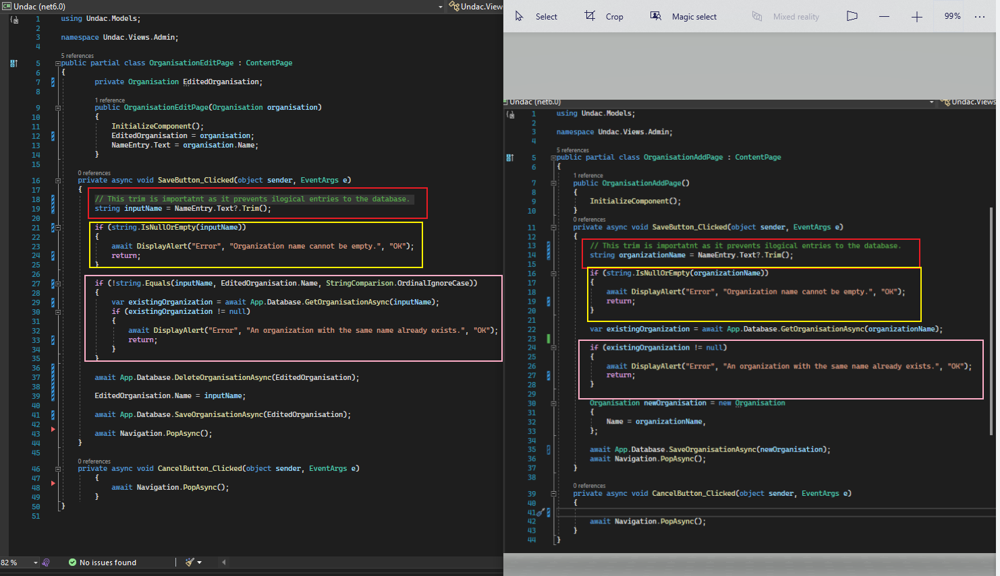

*Figure 15: Add Page - Before DRY refactor highlighted repeating code*

### Code after
<a name="Figure_16"></a>
```
namespace Undac.Helpers
{
    public static class InputValidator
    {
        public static async Task<bool> OrganisationExistsInDatabaseAsync(string organisationName)
        {
            var existingOrganization = await App.Database.GetOrganisationAsync(organisationName);

            return existingOrganization != null;
        }
    }
}
```

*Figure 16: New class InputValidator - after DRY refactor* 


<a name="Figure_17"></a>
```
using Undac.Helpers;
using Undac.Models;

namespace Undac.Views.Admin;

public partial class OrganisationAddPage : ContentPage
{
	public OrganisationAddPage()
	{
		InitializeComponent();
	}
    private async void SaveButton_Clicked(object sender, EventArgs e)
    {
        // This trim is importatnt as it prevents ilogical entries to the database. 
        string inputName = NameEntry.Text?.Trim(); 

        if (string.IsNullOrEmpty(inputName))
        {
            await DisplayAlert("Error", "Organization name cannot be empty.", "OK");
            return; 
        }

        if (await InputValidator.OrganisationExistsInDatabaseAsync(inputName))
        {
            await DisplayAlert("Error", "An organization with the same name already exists.", "OK");
            return;
        }

        Organisation newOrganisation = new Organisation
        {
            Name = inputName,
        };

        await App.Database.SaveOrganisationAsync(newOrganisation); 
        await Navigation.PopAsync();
    }

    private async void CancelButton_Clicked(object sender, EventArgs e)
    {
        await Navigation.PopAsync();
    }
}
```

*Figure 17: OrganisationAddPage Class - after DRY refactor* 


```
using Undac.Helpers;
using Undac.Models;

namespace Undac.Views.Admin;

public partial class OrganisationEditPage : ContentPage
{
        private Organisation EditedOrganisation;

        public OrganisationEditPage(Organisation organisation)
        {
            InitializeComponent();
            EditedOrganisation = organisation;
            NameEntry.Text = organisation.Name;
        }

    private async void SaveButton_Clicked(object sender, EventArgs e)
    {
        // This trim is importatnt as it prevents ilogical entries to the database. 
        string inputName = NameEntry.Text?.Trim(); 

        if (string.IsNullOrEmpty(inputName))
        {
            await DisplayAlert("Error", "Organization name cannot be empty.", "OK");
            return; 
        }

        if (!string.Equals(inputName, EditedOrganisation.Name, StringComparison.OrdinalIgnoreCase))
        {
            if (await InputValidator.OrganisationExistsInDatabaseAsync(inputName))
            {
                await DisplayAlert("Error", "An organization with the same name already exists.", "OK");
                return; 
            }
        }

        await App.Database.DeleteOrganisationAsync(EditedOrganisation);

        EditedOrganisation.Name = inputName;

        await App.Database.SaveOrganisationAsync(EditedOrganisation);

        await Navigation.PopAsync();
    }

    private async void CancelButton_Clicked(object sender, EventArgs e)
        {
            await Navigation.PopAsync();
        }
}

```

*Figure 18: OrganisationEditPage Class - after DRY refactor* 
<a name="Figure_18"></a>


### Explanation
My OrganisationEditPage and OrganisationAddPage classes are reusing the same code. On the [Figure 14] I have highlighted areas of the code that violate DRY principle. 

Starting with the top highlight of the [Figure 14]. Creating a method that would trim the input would not make sense, I could potentially put it in validator methods but that would  mean that I have to keep repeating the same line again. This would result in the same amount of repetitions.

Looking at the yellow highlight of the [Figure 14], I decided not create a method that checks if a string is null or empty because I still have to kepp the if block to create an alert and return before saving the input. Aside from that this code is readable and encapsulating that logic would not improve the readablity too much.

The pink highlight on the [Figure 14] was refactored. I created a helper class with input validation method that would encapsulate the check in the database and I reused it across both classes. 


## YAGNI
### Overview
You Ain't Gonna Need It (YAGNI) refers to adding extra functionality to the code. This might include attempts to add a piece of code that could be useful in the future or fulfiling requirements that are not a part of the acceptance criteria. 

### Example
```
using SQLite;
using Undac.Models;

namespace Undac.Data
{
    public interface IRepository<T>
    {
        Task<int> InsertAsync(T entity);
        Task<int> UpdateAsync(T entity);
        Task<int> DeleteAsync(T entity);
    }
    public class Repository<T> : IRepository<T> where T : class
    {
        string DatabasePath;
        public SQLiteAsyncConnection Database;

        public Repository(string databasePath)
        {
            DatabasePath = databasePath;
        }

        public async Task Init()
        {

            if (Database is not null)
                return;

            Database = new SQLiteAsyncConnection(DatabasePath, Constants.Flags);
            var result = await Database.CreateTableAsync<Organisation>();
        }

        public async Task<int> InsertAsync(T entity)
        {
            await Init();
            var result = await Database.InsertAsync(entity);
            return result;
        }

        public async Task<int> UpdateAsync(T entity)
        {
            await Init();
            var result = await Database.UpdateAsync(entity);
            return result;
        }

        public async Task<int> DeleteAsync(T entity)
        {
            await Init();
            var result = await Database.DeleteAsync(entity);
            return result;
        }
    }
}
```
*Figure 19: Generic class for database access* 
<a name="Figure_19"></a>

### Explanation

While working on my ticket I decided to create a class that would possibly simplify the process of saving items to the database and reduce code needed to implement saving various models to the database.

Unfortunately, this is wrong for few reasons. Firstly, this is not a part of my ticket and I have been wasting time that was meant to be spent on acceptance criteria for my ticket. 
We have not decided as a team how we are going to approach this issues and there is a disscussion to be had about the implementation. We could potentially find a better solution than my approach.
As a result I have deleted the class. 


## Doxygen Comments
```
using SQLite;
using Undac.Models;

namespace Undac.Data
{
    /// <summary>
    /// Represents a database for storing and retrieving data related to organisations.
    /// </summary>
    public class UndacDatabase
    {
        private string DatabasePath;
        public SQLiteAsyncConnection Database;

        /// <summary>
        /// Initializes a new instance of the <see cref="UndacDatabase"/> class.
        /// </summary>
        /// <param name="databasePath">The path to the SQLite database file.</param>
        public UndacDatabase(string databasePath)
        {
            DatabasePath = databasePath;
        }

        /// <summary>
        /// Initializes the database connection and creates the Organisation table if it does not exist.
        /// </summary>
        public async Task Init()
        {
            if (Database is not null)
                return;

            Database = new SQLiteAsyncConnection(DatabasePath, Constants.Flags);
            var result = await Database.CreateTableAsync<Organisation>();
        }

        /// <summary>
        /// Retrieves a list of all organisations asynchronously.
        /// </summary>
        /// <returns>A list of Organisation objects.</returns>
        public async Task<List<Organisation>> GetOrganisationsAsync()
        {
            await Init();
            return await Database.Table<Organisation>().ToListAsync();
        }

        /// <summary>
        /// Retrieves an organisation by its name asynchronously.
        /// </summary>
        /// <param name="name">The name of the organisation to retrieve.</param>
        /// <returns>An Organisation object, or null if not found.</returns>
        public async Task<Organisation> GetOrganisationAsync(string name)
        {
            await Init();
            return await Database.Table<Organisation>().Where(i => i.Name == name).FirstOrDefaultAsync();
        }

        /// <summary>
        /// Saves an organisation asynchronously. If an organisation with the same name already exists, it is updated.
        /// </summary>
        /// <param name="item">The Organisation object to save or update.</param>
        /// <returns>The number of affected rows in the database.</returns>
        public async Task<int> SaveOrganisationAsync(Organisation item)
        {
            await Init();

            var existingOrganisation = await GetOrganisationAsync(item.Name);
            if (existingOrganisation != null)
            {
                await Database.DeleteAsync(existingOrganisation);
            }

            return await Database.InsertAsync(item);
        }

        /// <summary>
        /// Deletes an organisation asynchronously.
        /// </summary>
        /// <param name="item">The Organisation object to delete.</param>
        /// <returns>The number of affected rows in the database.</returns>
        public async Task<int> DeleteOrganisationAsync(Organisation item)
        {
            await Init();
            return await Database.DeleteAsync(item);
        }
    }
}

```
*Figure 20: Database Access layer with xml comments* 
<a name="Figure_20"></a>


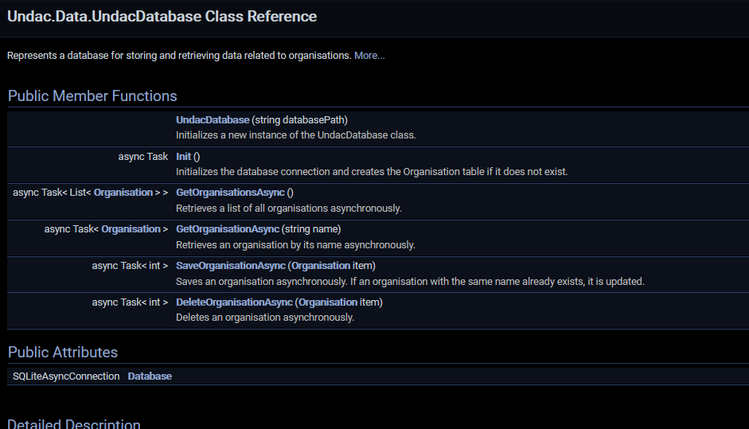

*Figure 21: Database Access layer Doxygen HTML view* 

```
using System.Collections.ObjectModel;
using System.ComponentModel;
using Undac.Models;

namespace Undac.Views.Admin
{
    /// <summary>
    /// Represents a page displaying a list of organisations.
    /// </summary>
    public partial class OrganisationsPage : ContentPage, INotifyPropertyChanged
    {
        /// <summary>
        /// Gets or sets the collection of organisations displayed on the page.
        /// </summary>
        public ObservableCollection<Organisation> Organisations { get; set; }

        /// <summary>
        /// Initializes a new instance of the <see cref="OrganisationsPage"/> class.
        /// </summary>
        public OrganisationsPage()
        {
            InitializeComponent();
            LoadOrganisations();
            BindingContext = this;
        }

        /// <summary>
        /// Called when the page is about to appear on the screen.
        /// </summary>
        protected override void OnAppearing()
        {
            base.OnAppearing();
            LoadOrganisations();
        }

        /// <summary>
        /// Loads the list of organisations from the database and updates the UI.
        /// </summary>
        private async void LoadOrganisations()
        {
            var organisations = await App.Database.GetOrganisationsAsync();
            Organisations = new ObservableCollection<Organisation>(organisations);
            OnPropertyChanged(nameof(Organisations));
        }

        /// <summary>
        /// Event handler for the "Add" button click.
        /// Navigates to the page for adding a new organisation.
        /// </summary>
        private void AddButton_Clicked(object sender, EventArgs e)
        {
            Navigation.PushAsync(new OrganisationAddPage());
        }

        /// <summary>
        /// Event handler for the "Edit" button click.
        /// Navigates to the page for editing the selected organisation.
        /// </summary>
        private void EditButton_Clicked(object sender, EventArgs e)
        {
            if (OrganisationsListView.SelectedItem != null)
            {
                Organisation selectedOrganisation = (Organisation)OrganisationsListView.SelectedItem;
                Navigation.PushAsync(new OrganisationEditPage(selectedOrganisation));
            }
        }

        /// <summary>
        /// Event handler for the "Remove" button click.
        /// Deletes the selected organisation from the database and updates the UI.
        /// </summary>
        private async void RemoveButton_Clicked(object sender, EventArgs e)
        {
            if (OrganisationsListView.SelectedItem != null)
            {
                await App.Database.DeleteOrganisationAsync((Organisation)OrganisationsListView.SelectedItem);
                Organisations.Remove((Organisation)OrganisationsListView.SelectedItem);
            }
        }
    }
}
```
*Figure 22: OrganisationPage with xml comments* 
<a name="Figure_22"></a>


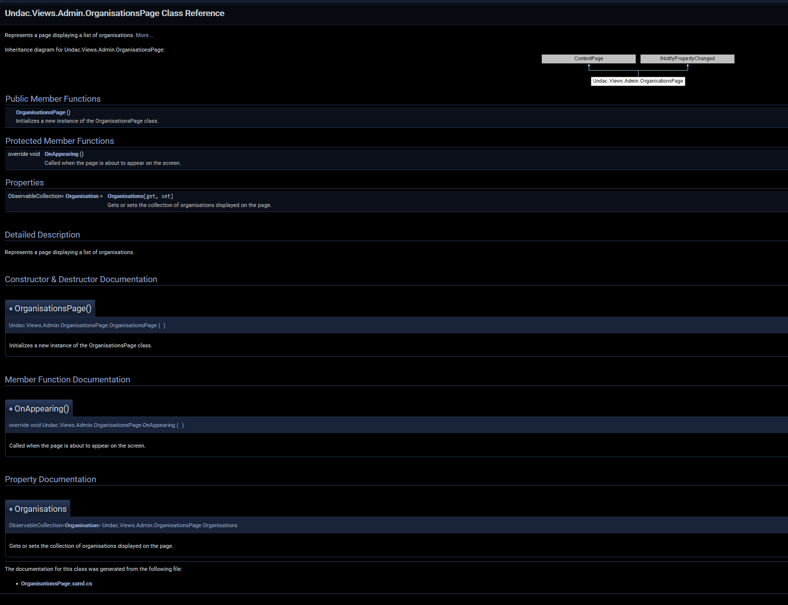

*Figure 23: OrganisationPage Doxygen HTML view* 


```
using Undac.Helpers;
using Undac.Models;

namespace Undac.Views.Admin
{
    /// <summary>
    /// Represents a page for editing an organisation.
    /// </summary>
    public partial class OrganisationEditPage : ContentPage
    {
        private Organisation EditedOrganisation;

        /// <summary>
        /// Initializes a new instance of the <see cref="OrganisationEditPage"/> class.
        /// </summary>
        /// <param name="organisation">The organisation to edit.</param>
        public OrganisationEditPage(Organisation organisation)
        {
            InitializeComponent();
            EditedOrganisation = organisation;
            NameEntry.Text = organisation.Name;
        }

        /// <summary>
        /// Event handler for the "Save" button click.
        /// Validates and saves the edited organisation data.
        /// </summary>
        private async void SaveButton_Clicked(object sender, EventArgs e)
        {
            // This trim is important as it prevents illogical entries in the database.
            string inputName = NameEntry.Text?.Trim();

            if (string.IsNullOrEmpty(inputName))
            {
                await DisplayAlert("Error", "Organization name cannot be empty.", "OK");
                return;
            }

            if (!string.Equals(inputName, EditedOrganisation.Name, StringComparison.OrdinalIgnoreCase))
            {
                if (await InputValidator.OrganisationExistsInDatabaseAsync(inputName))
                {
                    await DisplayAlert("Error", "An organization with the same name already exists.", "OK");
                    return;
                }
            }

            await App.Database.DeleteOrganisationAsync(EditedOrganisation);

            EditedOrganisation.Name = inputName;

            await App.Database.SaveOrganisationAsync(EditedOrganisation);

            await Navigation.PopAsync();
        }

        /// <summary>
        /// Event handler for the "Cancel" button click.
        /// Cancels the editing operation and navigates back.
        /// </summary>
        private async void CancelButton_Clicked(object sender, EventArgs e)
        {
            await Navigation.PopAsync();
        }
    }
}

```
*Figure 24: EditPage with xml comments* 
<a name="Figure_24"></a>


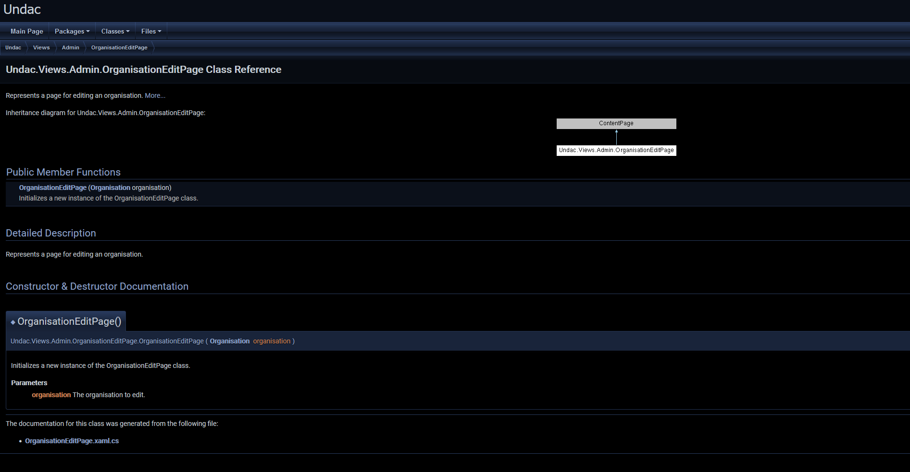

*Figure 25: EditPage Doxygen HTML view* 

```
using Undac.Helpers;
using Undac.Models;

namespace Undac.Views.Admin
{
    /// <summary>
    /// Represents a page for adding a new organisation.
    /// </summary>
    public partial class OrganisationAddPage : ContentPage
    {
        /// <summary>
        /// Initializes a new instance of the <see cref="OrganisationAddPage"/> class.
        /// </summary>
        public OrganisationAddPage()
        {
            InitializeComponent();
        }

        /// <summary>
        /// Event handler for the "Save" button click.
        /// Validates and saves the new organisation data.
        /// </summary>
        private async void SaveButton_Clicked(object sender, EventArgs e)
        {
            // This trim is important as it prevents illogical entries in the database.
            string inputName = NameEntry.Text?.Trim();

            if (string.IsNullOrEmpty(inputName))
            {
                await DisplayAlert("Error", "Organization name cannot be empty.", "OK");
                return;
            }

            if (await InputValidator.OrganisationExistsInDatabaseAsync(inputName))
            {
                await DisplayAlert("Error", "An organization with the same name already exists.", "OK");
                return;
            }

            Organisation newOrganisation = new Organisation
            {
                Name = inputName,
            };

            await App.Database.SaveOrganisationAsync(newOrganisation);
            await Navigation.PopAsync();
        }

        /// <summary>
        /// Event handler for the "Cancel" button click.
        /// Cancels the organization addition operation and navigates back.
        /// </summary>
        private async void CancelButton_Clicked(object sender, EventArgs e)
        {
            await Navigation.PopAsync();
        }
    }
}

```
*Figure 26: AddPage with xml comments* 
<a name="Figure_26"></a>


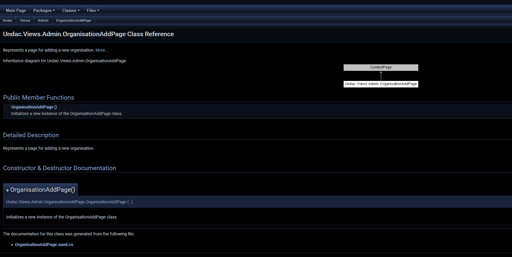

*Figure 27: AddPage Doxygen HTML view* 

```
using SQLite;
using System;
using System.Collections.Generic;
using System.Linq;
using System.Text;
using System.Threading.Tasks;

namespace Undac.Models
{
    /// <summary>
    /// Represents an organisation entity.
    /// </summary>
    [Table("Organisations")]
    public class Organisation
    {
        /// <summary>
        /// Gets or sets the name of the organisation. This property is the primary key.
        /// </summary>
        [PrimaryKey]
        public string Name { get; set; }
    }
}
```
*Figure 28: AddPage with xml comments* 


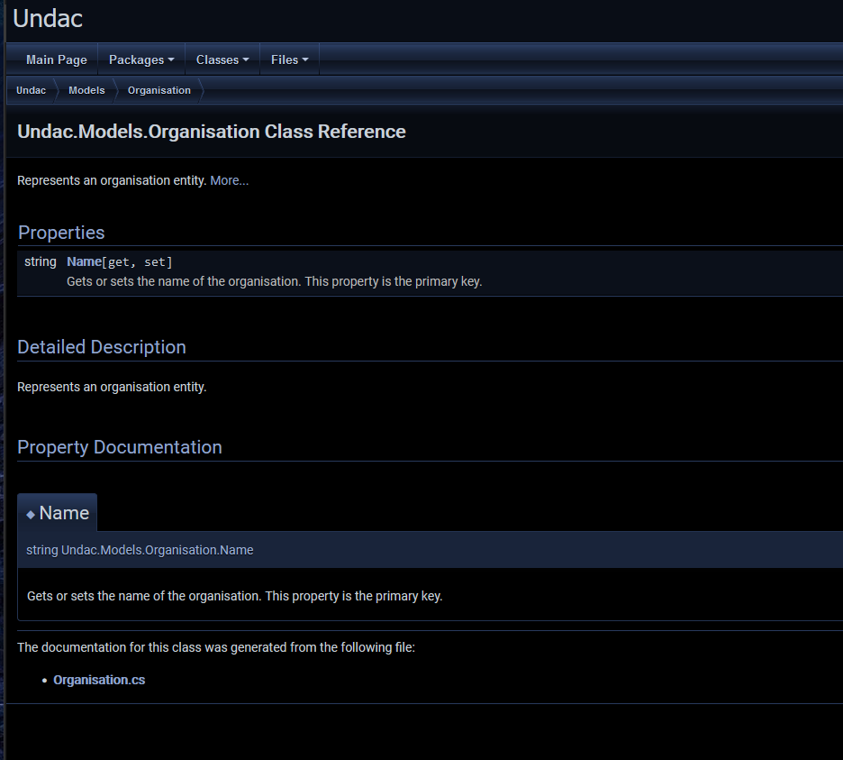

*Figure 29: AddPage Doxygen HTML view* 


### Structure
The XML comments start with *///* and the summary tag is generated by Visual Studio. Within the summary tag, a short description is provided just as it can be seen in Figure 27. This is done for all classes and methods. But summary tags are not the only tags available. In Figure 24 the *param name* tag was used to describe the parameter but there are more tags allowing for even better description of the code. 

The HTML view of Doxygen contains all the information contained in the XML comments. On the [Figure 29] all classes with descriptions can be seen. The [Figure 29] provides an insight into one of the classes and apart from viewing the description of the class and the methods within there is a diagram representing the class and its inheritance. 


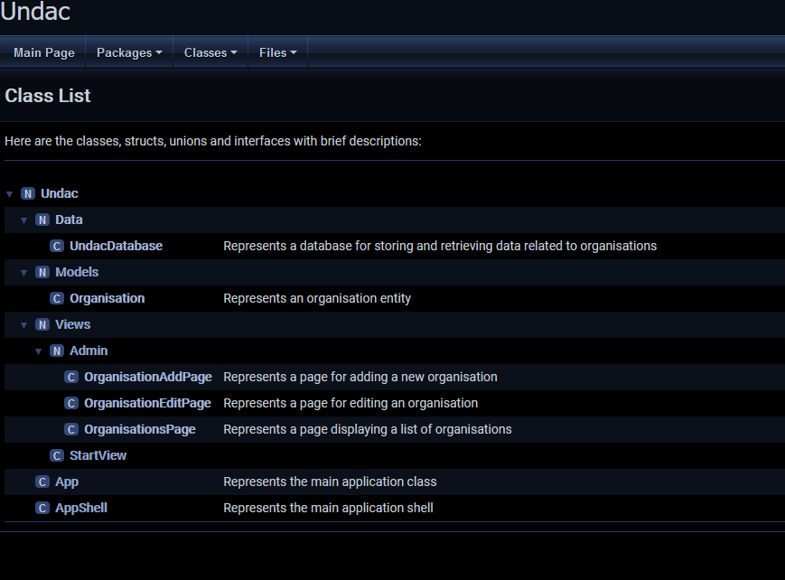

*Figure 30: Class Doxygen HTML view* 

### Purpose

Creating a good documentation allows users and other developers to understand the software better. Doxygen provides easy to use HTML format that can even generate class diagrams and map inhearitance. The organised nature of this soultion is great for reducing the learning curve for the code maintainers. 

## Eliminating comments

### Meaningful Names 
By changing variable name to something that describes its role better I was able to remove a comment describing the role of the variable. 
The initial state can be seen on the [Figure 1](#Figure_1) where I used abbreviated name *org* to store a reference to an organisation retrieved from the database. Changing the name to *exisitngOrganisation* makes the code more redable and allows others to understand the purpose of the variable. This can be seen on the [Figure 11](#Figure_11)

### Obvious comments
On the [Figure 5](#Figure_5) in the *CancelButton_Clicked* there is a comment before *await Navigation.PopAsync();* which seems reduntant as the function call is simple and the method name is descriptive. This means that the comments states the obvious and it is not required for anything. The version of this code witout a comment can be seen on the [Figure 11](#Figure_11).

### Extracting Method to improve code readability  
On the [Figure 16](#Figure_16) I have introduced a new class which also contribiuted toward removing comments from the code within the *SaveButton_Clicked* method. The [Figure 17](#Figure_17) shows how adding a call with a descriptive function name makes the comment describing functionality redundant. 


## References
Alls, J. (2020). Clean Code in C#. Packt Publishing Ltd.

Martin, R. C. (2010). Clean code a handbook of agile software craftmanship. Upper Saddle River [Etc.] Prentice Hall.
‌
Microsoft. (2023, August 1). C# identifier names. Retrieved October 2, 2023, from learn.microsoft.com website: https://learn.microsoft.com/en-us/dotnet/csharp/fundamentals/coding-style/identifier-names

Microsoft (Ed.). (2023b, June 15). C# Coding Conventions. Retrieved October 5, 2023, from learn.microsoft.com website: https://learn.microsoft.com/en-us/dotnet/csharp/fundamentals/coding-style/coding-conventions
‌
‌

[Figure 3]: https://github.com/WilkMat3/SET09102_Personal_Portfolio/blob/main/images/NamingChanges.png "Figure 3"
[Figure 6]: https://github.com/WilkMat3/SET09102_Personal_Portfolio/blob/main/images/SpacingChange.PNG "Figure 6"
[Figure 9]: https://github.com/WilkMat3/SET09102_Personal_Portfolio/blob/main/images/CommentsChange.png "Figure 9"
[Figure 12]: https://github.com/WilkMat3/SET09102_Personal_Portfolio/blob/main/images/KISS.png "Figure 12"
[Figure 15]: https://github.com/WilkMat3/SET09102_Personal_Portfolio/blob/main/images/DRYBefore.png "Figure 15"
[Figure 21]: https://github.com/WilkMat3/SET09102_Personal_Portfolio/blob/main/images/UndacCommentsHTML.PNG "Figure 21"
[Figure 23]: https://github.com/WilkMat3/SET09102_Personal_Portfolio/blob/main/images/OrganisationPageHTML.PNG "Figure 23"
[Figure 25]: https://github.com/WilkMat3/SET09102_Personal_Portfolio/blob/main/images/EditPageHTML.PNG "Figure 25"
[Figure 27]: https://github.com/WilkMat3/SET09102_Personal_Portfolio/blob/main/images/AddPageHTML.PNG "Figure 27"
[Figure 29]: https://github.com/WilkMat3/SET09102_Personal_Portfolio/blob/main/images/OrgModelHTML.PNG "Figure 29"
[Figure 30]: https://github.com/WilkMat3/SET09102_Personal_Portfolio/blob/main/images/ClassViewHTML.PNG "Figure 30"