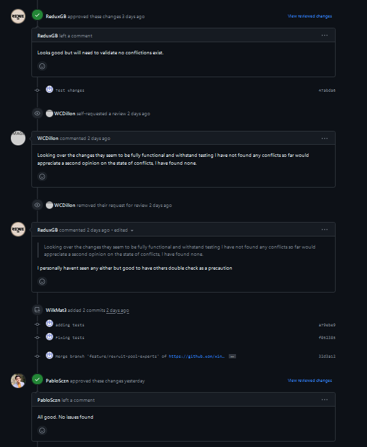
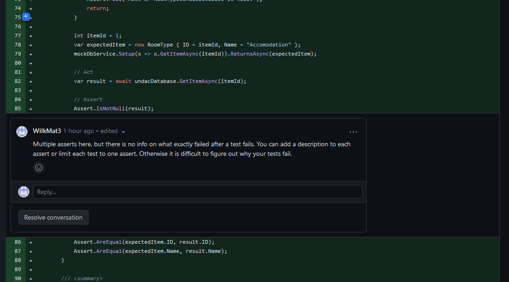
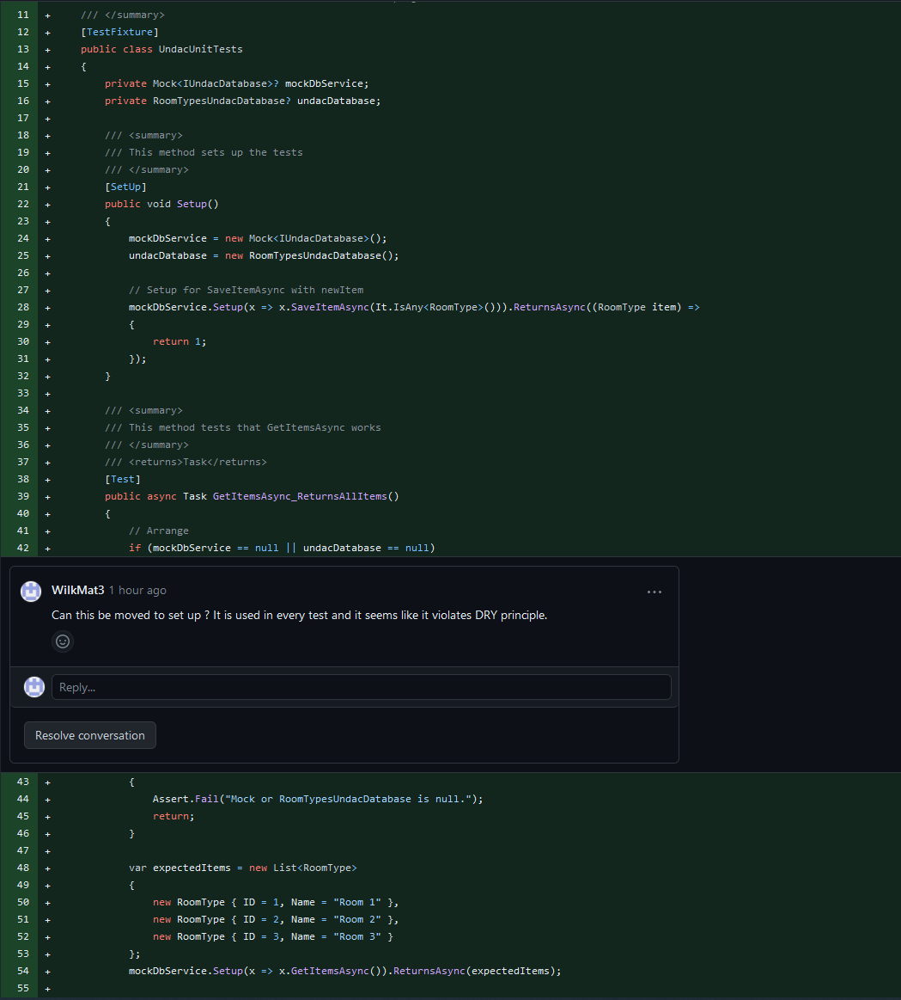

# Project work 1
## Summary
This week I have been working on the [Access lists of pool experts so that I can recruit them into the team] issue. The work was split between two people, I would be taking care of CRUD methods and tests and my colleague would take care of UI and views. 
As a part of the acceptance criteria we had to make sure that the implementation allows for viewing a pool of experts along with their associations status, status change date and working location.

I wanted to implement the repository pattern for our ticket. We keep adding extra models to the project and there is a lot of code repetitions because of that. This violates the DRY principle as each implementation of crud functions on an object is basically a repetition. 

Firstly, I created the interface with all required CRUD methods as per Fig 1. The *T* is a placeholder that represents a generic type. 

```
namespace Undac.Data.Repositories
{
    public interface IRepository<T> where T : class
    {
        Task<List<T>> GetAllAsync();
        Task<T> GetAsync(int id);
        Task<int> SaveAsync(T item);
        Task<int> DeleteAsync(T item);
    }
}
```
*Figure 1: Repository Pattern generic interface


The Repository class is storing method implementation that will be used with different model objects. I had to specify that the *T* placeholoder would be a class or an interface and that it will have parameterless constructor as per the sginature of the class:
``
public class Repository<T> : IRepository<T> where T : class, new()
``

we are using SQL Lite and we inject the SQLLiteAsyncConnection to the constructor so that the CRUD operations can be done on our database.

```
using SQLite;
using Undac.Models;

namespace Undac.Data.Repositories
{
    /// <summary>
    /// This class manages the Repository
    /// </summary>
    public class Repository<T> : IRepository<T> where T : class, new()
    {
        public readonly SQLiteAsyncConnection database;

        /// <summary>
        /// Constructor for the Repository class
        /// </summary>
        /// <param name="database">An instance of the database</param>
        public Repository(SQLiteAsyncConnection database)
        {
            this.database = database;
        }

        /// <summary>
        /// This method gets all items from the database
        /// </summary>
        /// <returns>A list of items</returns>
        public async Task<List<T>> GetAllAsync()
        {
            return await database.Table<T>().ToListAsync();
        }

        /// <summary>
        /// This method gets an item from the database
        /// </summary>
        /// <param name="id">Id of the item</param>
        /// <returns>An item</returns>
        public async Task<T> GetAsync(int id)
        {
            var idProperty = typeof(T).GetProperty("Id");

            if (idProperty != null && idProperty.PropertyType == typeof(int))
            {
                return await database.FindAsync<T>(id);
            }
            else
            {
                throw new InvalidOperationException($"The entity of type {typeof(T).Name} does not have an 'Id' property.");
            }
        }

        /// <summary>
        /// This method saves an item to the database
        /// </summary>
        /// <param name="item">An item</param>
        public async Task<int> SaveAsync(T item)
        {
            if (item == null)
                throw new ArgumentNullException(nameof(item));

            var identifiable = item as IIdentifiable;
            if (identifiable != null && identifiable.Id != 0)
            {
                return await database.UpdateAsync(item);
            }
            else
            {
                return await database.InsertAsync(item);
            }
        }

        /// <summary>
        /// This method deletes an item from the database
        /// </summary>
        /// <param name="item">An item</param>
        public async Task<int> DeleteAsync(T item)
        {
            if (item == null)
                throw new ArgumentNullException(nameof(item));

            return await database.DeleteAsync(item);
        }
    }
}
```
*Figure 2: Repository Pattern generic CRUD implementation


On the Figure 3 & 4 I have included the implementation of specific interface and repository class. I both cases I specify that an Expert object would be used with those implementations, this still uses the generic repository for basic CRUD operations. If I wanted to have a method specific to ExpertRepository I could have included it in the IExpertRepository interface and ExpertRepository. Otherwise I just inherit the base methods from Repository class. Thanks to this implementation only new repositories need to be added and not the same crud methods and classes for each type.

```
using Undac.Models;

namespace Undac.Data.Repositories
{
    /// <summary>
    /// This interface links IExpertRepository to IRepository
    /// </summary>
    public interface  IExpertRepository :IRepository<Expert>{}
}

```
*Figure 3: Repository Pattern -  interface for Expert repository

```
using SQLite;
using Undac.Models;

namespace Undac.Data.Repositories
{
    /// <summary>
    /// This class manages the ExpertRepository
    /// </summary>
    public class ExpertRepository : Repository<Expert>, IExpertRepository
    {
        /// <summary>
        /// Constructor for the ExpertRepository class
        /// </summary>
        /// <param name="database">An instance of the database</param>
        public ExpertRepository(SQLiteAsyncConnection database) : base(database){}
    }
}
```
*Figure 4: Repository Pattern -Expert repository


On the Figure 5, I used the dependecy injection to inject the ExpertRepository into the class as can be seen in the constructor. the *OnStatusChanged()* is using the *SaveAsync(expert)* method inherited from the Repository class to save the expert in the database. 

```
using Undac.Models;
using Undac.Data.Repositories;

namespace Undac.Views;

/// <summary>
/// This class contains the logic for the EditExpertPage page
/// </summary>
public partial class EditExpertPage : ContentPage
{
    private Expert expert;
    private readonly IExpertRepository _expertsRepo;

    /// <summary>
    /// Constructor for the EditExpertPage class
    /// </summary>
    /// <param name="expert">The expert to edit</param>
    public EditExpertPage(Expert expert, IExpertRepository expertsRepo)
    {
        InitializeComponent();

        this.expert = expert;
        _expertsRepo = expertsRepo;
    }

    /// <summary>
    /// This method updates the status of the expert
    /// </summary>
    /// <param name="sender"></param>
    /// <param name="e"></param>
    public async void OnStatusChanged(object sender, EventArgs e)
    {
        if (PickerStatus.SelectedIndex >= 0)
        {
            expert.Status = (string)PickerStatus.SelectedItem;
            expert.StatusChangedDate = DateTime.Now;

            await _expertsRepo.SaveAsync(expert);
            await Navigation.PopAsync();
        }
    }
}
```
*Figure 5: Using repository pattern

## Testing

I have added tests to check the CRUD operations using the repository pattern on with Experts object. We have decided to use NUnit as a group as a testing framework. The Tests cover happy path for all Crud operations as seen on the Figure 6. This is something I could expand on in two ways. Firstly, I can try mocking the database instead of creating a test database. Secondly, I could try adding more edge case tests to try to break the program which would ensure that we have some form of error handling within our code. 


```
using Moq;
using System.Xml.Linq;
using Undac.Data;
using Undac.Data.Repositories;
using Undac.Models;

namespace UndacTests.ExpertCrudTests
{
    [TestFixture]
    public class ExpertCrudTests
    {
        private UndacDatabase _database;
        private string testDatabasePath;
        private IExpertRepository repo;


        [OneTimeSetUp]
        public async Task OneTimeSetUpAsync()
        {
            // Create a test database file path within your unit test project
            testDatabasePath = Path.Combine(TestContext.CurrentContext.TestDirectory, "TestFiles", "TestDB.db3");

            // Create an instance of UndacDatabase using the test database path
            _database = new UndacDatabase(testDatabasePath);
            await _database.Init();
            repo = new ExpertRepository(_database.Database);
        }

        [OneTimeTearDown]
        public void TearDownA()
        {
            Directory.Delete(testDatabasePath);
        }

        [Test]
        public async Task AddExpertTestAsync()
        {
            var testExpert = new Expert
            {
                Name = "Test",
                Skill = " a",
                Status = "b",
                StatusChangedDate = DateTime.Now,
                GeographicalLocation = " t",
                WorkingLocation = "hybrid"
            };
            await repo.SaveAsync(testExpert);

            Expert readExpert = await repo.GetAsync(testExpert.Id);
            Assert.That(readExpert, Is.Not.Null, " Test Expert was not saved");
            Assert.That(readExpert.Name, Is.EqualTo(testExpert.Name), " Test Expert name not matching");
        }

        [Test]
        public async Task DeleteOrganisationTestAsync()
        {
            var testExpert = new Expert
            {
                Name = "Test2",
                Skill = " a",
                Status = "b",
                StatusChangedDate = DateTime.Now,
                GeographicalLocation = " t",
                WorkingLocation = "hybrid"
            };
            await repo.SaveAsync(testExpert);

            await repo.DeleteAsync(await repo.GetAsync(testExpert.Id));
            var readExpert2 = await repo.GetAsync(testExpert.Id);

            Assert.That(readExpert2, Is.Null, " Test Organisation was not deleted");
        }

        [Test]
        public async Task GetOrganisationsTestAsync()
        {
            var testExpert = new Expert
            {
                Name = "Test1",
                Skill = " a",
                Status = "b",
                StatusChangedDate = DateTime.Now,
                GeographicalLocation = " t",
                WorkingLocation = "hybrid"
            };
            var testExpert2 = new Expert
            {
                Name = "Test2",
                Skill = " a",
                Status = "b",
                StatusChangedDate = DateTime.Now,
                GeographicalLocation = " t",
                WorkingLocation = "hybrid"
            };
            await repo.SaveAsync(testExpert);
            await repo.SaveAsync(testExpert2);

            var expertList = await repo.GetAllAsync();
            var expert1 = expertList.FirstOrDefault(organization => organization.Name == testExpert.Name);
            var expert2 = expertList.FirstOrDefault(organization => organization.Name == testExpert2.Name);

            Assert.That(expert1.Name, Is.EqualTo(testExpert.Name), "The first test organisation was not retrieved");
            Assert.That(expert2.Name, Is.EqualTo(testExpert2.Name), "The second test organisation was retrieved");
        }

    }
}
```
*Figure 6: Test methods with new Repository pattern

## Getting my code reviewed
The reviews we received were not insightful, unfortunately nobody pointed out anything interesting for our PR. 



*Figure 7: Reviews for my pull request

On the other hand pairing up for this pr enabled other form of feedback as my colleague gave me some informal reviews regarding my code format and usage of empty lines. 
On a couple of occasions I have left empty lines at the begining of the method which was redundant and did not add to the code readability. I have never noticed that, and I will definately pay attention to it from now on. 

## Leading a code review
I have reviewed several PRs this week mostly focusing on basics such as checking if code compiles without any errors and all tests pass. I have been paying attention to code formatting, C# conventions as well as the rules of Clean Code such as DRY and YAGNI.

Alls(2020) in his book writes that when leading a code review we should be encouraging and not overly crictical. Providing constructive feedback is important as this is one of the ways develepers improve. In my comments I have tried to be factual and contain explanation of why I think a piece of code should be changed.

I had an opportunity to review a test project for one of the pull requests and I found two interesting issues that I wanted to mention.
The code one the Figure 9 shows a test which is split into three steps Arrange Act and Assert.
The problem with this particular code is the Assert statements. During my placement I was told that multiple Assert statements are sometimes necessary but they should always be accompanied by a comment. The implementation below does not include a meaningful comment to each assert statement, if a test fails we won't know what caused the fail. To fix the issue we would have to spend more time investigating. By adding a commentary to the test we can add more context to each assert statement. 

```
        [Test]
        public async Task GetItemAsync_ReturnsCorrectItem()
        {
            // Arrange
            if (mockDbService == null || undacDatabase == null)
            {
                Assert.Fail("Mock or RoomTypesUndacDatabase is null.");
                return;
            }

            int itemId = 1;
            var expectedItem = new RoomType { ID = itemId, Name = "Accomodation" };
            mockDbService.Setup(x => x.GetItemAsync(itemId)).ReturnsAsync(expectedItem);

            // Act
            var result = await undacDatabase.GetItemAsync(itemId);

            // Assert
            Assert.IsNotNull(result);
            Assert.AreEqual(expectedItem.ID, result.ID);
            Assert.AreEqual(expectedItem.Name, result.Name);
        }
```
*Figure 9: Reviewed Code - Multiple Asserts

On the Figure 10 I have included the comment I left on the PR. As mentioned before I wanted to give more context for the other group memeber so they can understand why it would make sense to add a comment to a test. 


*Figure 10: Reviewed Code - Multiple Asserts - Comment

On the Figure 11 we can see another test taken from the same test class. In the arrange section there we can see that the if statement is repeated ( same as on the Figure 9).
NUnit provides SetUp methods that allow for some code reusability, especially when it comes to arranging test data. 
I have advised to move that part to the SetUp methods to prevent violating DRY principle as per the Figure 12 comment.

```
     /// <summary>
        /// This method tests that SaveItemAsync works on existing items
        /// </summary>
        /// <returns>Task</returns>
        [Test]
        public async Task SaveItemAsync_ExistingItem_EditsItem()
        {
            // Arrange
            // Ensure both mockDbConnection and undacDatabase are not null
            if (mockDbService == null || undacDatabase == null)
            {
                Assert.Fail("Mock or RoomTypesUndacDatabase is null.");
                return;
            }

            var existingItem = new RoomType { ID = 1, Name = "Existing Room" };
            mockDbService.Setup(x => x.SaveItemAsync(existingItem)).ReturnsAsync(1);

            // Act
            var result = await undacDatabase.SaveItemAsync(existingItem);

            // Assert
            Assert.AreEqual(1, result);
            mockDbService.Verify(x => x.SaveItemAsync(existingItem), Times.Once);
        }
```
*Figure 11: Reviewed Code - DRY


*Figure 12: Reviewed Code - DRY- Comment

## Reflections
Every ticket we have has a drastically different implementation. This week I have worked on the Repository pattern for my ticket and after a brief discussion we decided that the whole team should implement this approach within their implementation. Simmilarly, we talked about changes to the UI implementation. We decided that one person will implement a UI that we can reuse for all of our tickets. This might not be completed this week but we will adapt those changes. This apporach helps with the issues we have as a team. On the other hand this might reduce learning for some team members as we are reusing the code for consistency. 

In general, our team has maybe 5-6 people who are regulary contribuitng to the project. Adding the common UI and the Repository patterns helped with engagement. This could be because we finally agreed to do something as a team and organised our work a bit. We are still far from being effective, good example of potential improvement are reviews which in case of PR that I created were not insightful. I felt that no one looked into my PR properly hence the reviews were like that. Another good example is amount of pull requests ready to be revieved by Sunday afternoon. Including my PR there were only two other PRs. 
In my opinion we do not work as a Scrum team. I can compare it to my placement expirience where the team had daily standups and other ceremonies that helped keeping everyone focused. We are not doing any of that. The Discord channel is a good way of communicating but it is irregular. This is something that we could improve. At least we could conduct a weekly stand up on Monday.

I think that the level of work produced this week was much highier than previously. I paired up with Marco to work on my ticket and thanks to his insights I was able to improve my code. I personally, still feel that I have not understood how to use dependecy injection properly and I have to spend more time next week how I can use it within MAUI app. Specifically, I am unsure how automatically dependencies are injected after declaring them as singletions in the app builder. 

## References
Alls, J. (2020). Clean Code in C#. Packt Publishing Ltd.

fullstackcodr. (2021, November 21).net Generic Repository Pattern. Retrieved October 24, 2023, from DEV Community website: https://dev.to/fullstackcodr/net-generic-repository-pattern-4gf


‌
https://github.com/xinjoonha/SET09102_PURPLE/issues/48

[Figure 7]: https://github.com/WilkMat3/SET09102_Personal_Portfolio/blob/main/images/Reviews.png "Figure 7"

[Figure 10]: https://github.com/WilkMat3/SET09102_Personal_Portfolio/blob/main/images/Comment_MultipleAsserts.png "Figure 10"

[Figure 12]: https://github.com/WilkMat3/SET09102_Personal_Portfolio/blob/main/images/Comment_DRY.png "Figure 12"

