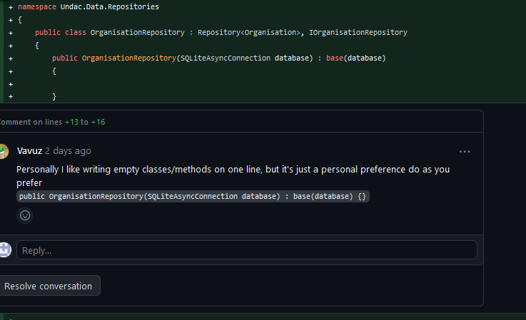
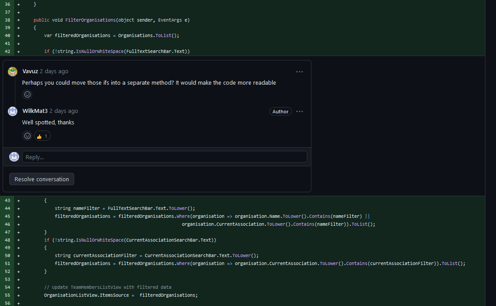

# Project work week 9
## Summary
This week I have been building on the work from week 3 by working on the [Maintain view lists of partner agencies (UN, International, national, NGO, voluntary)](https://github.com/xinjoonha/SET09102_PURPLE/issues/64). I have added a page that allows for viewing and filtering Organisations by name or associations status. This ticket also required  extending the organisation model by adding association status.

Overall, I have added two UI pages and one static class with filtering methods. I decided to use static class as it is easier to test. 
I attemted to use the MVVM architecture but I was unable to get the list view to populate with Organisations. Upon a further investigation I found that this is due to async method loading organisations from the database. I was unable to find solution for this issues, so I decided to revert to much simplier apporach that places all the logic within the View as wanted to deliver work on time.  

```
<?xml version="1.0" encoding="utf-8" ?>
<ContentPage xmlns="http://schemas.microsoft.com/dotnet/2021/maui"
             xmlns:x="http://schemas.microsoft.com/winfx/2009/xaml"
             x:Class="Undac.Views.ViewLists.ViewAllOrganisationsPage"
             BackgroundColor="{DynamicResource PageBackgroundColor}"
             Padding="16"
             Title="Search Organisations">
        <StackLayout>
            <Label Text="Filter Organisations" FontSize="Large" TextColor="{DynamicResource PrimaryTextColor}" HorizontalOptions="Center" Margin="10,20,10,0" />

            <SearchBar x:Name="FullTextSearchBar" Placeholder="Search by full text" Margin="10,10,10,0" BackgroundColor="{DynamicResource SearchBarBackgroundColor}" />
            <SearchBar x:Name="CurrentAssociationSearchBar" Placeholder="Search by Current Association Status" Margin="10,10,10,0" BackgroundColor="{DynamicResource SearchBarBackgroundColor}" />

            <ListView x:Name="OrganisationListView" ItemTapped="OnOrganisationClicked" SeparatorColor="{DynamicResource ListViewSeparatorColor}">
                <ListView.ItemTemplate>
                    <DataTemplate>
                        <ViewCell>
                            <StackLayout Margin="0,10,0,10" Padding="10" BackgroundColor="{DynamicResource ListItemBackgroundColor}">
                                <Label Text="{Binding Name}" FontAttributes="Bold" FontSize="16" TextColor="{DynamicResource TitleTextColor}" />
                                <Label Text="{Binding CurrentAssociation}" FontAttributes="Bold" FontSize="12" TextColor="Yellow" />
                            </StackLayout>
                        </ViewCell>
                    </DataTemplate>
                </ListView.ItemTemplate>
            </ListView>
        </StackLayout>
    </ContentPage>
```

*Figure 1: UI for viewing and filtering organisations*

As a team we decided to keep the UI consitent, therefore I reused the UI we already created for viewing and filtering experts. 


```
namespace Undac.Views.ViewLists;

public partial class ViewAllOrganisationsPage : ContentPage
{
    public ObservableCollection<Organisation> Organisations { get; set; }
    public event PropertyChangedEventHandler PropertyChanged;
    private IOrganisationRepository organisationRepository;

    public ViewAllOrganisationsPage()
	  {
		InitializeComponent();
        organisationRepository = new OrganisationRepository(App.Database.Database);
        LoadOrganisations();

        // Attach event handlers for filtering
        FullTextSearchBar.TextChanged += FilterOrganisations;
        CurrentAssociationSearchBar.TextChanged += FilterOrganisations;
        BindingContext = this;
    }

    protected override void OnAppearing()
    {
        base.OnAppearing();
        LoadOrganisations();
    }

    private async void LoadOrganisations()
    {
        var organisations = await organisationRepository.GetAllAsync();
        Organisations = new ObservableCollection<Organisation>(organisations);
        OrganisationListView.ItemsSource = Organisations;
        OnPropertyChanged(nameof(Organisations));
    }

    public void FilterOrganisations(object sender, EventArgs e)
    {
        var filteredOrganisations = Organisations.ToList();

        if (!string.IsNullOrWhiteSpace(FullTextSearchBar.Text))
        {
            filteredOrganisations = FilterMethods.FilterFullText(filteredOrganisations, FullTextSearchBar.Text);
        }

        if (!string.IsNullOrWhiteSpace(CurrentAssociationSearchBar.Text))
        {
            filteredOrganisations = FilterMethods.FilterAssociation(filteredOrganisations, CurrentAssociationSearchBar.Text);
        }

        // Update organisations with filtered data
        OrganisationListView.ItemsSource =  filteredOrganisations;
    }

    private async void OnOrganisationClicked(object sender, ItemTappedEventArgs e)
    {
        if (e.Item is Organisation organisation)
        {
            await Navigation.PushAsync(new OrganisationStatusPage(organisation, organisationRepository));
        }
    }
}
```

*Figure 2: Logic for viewing and filtering organisations*

I have adapted the logic to accomodate viewing and filtering organisations as per the Figure 2. Error handling was done within UI as this is considered a good approach. I worked on formatting of my code and removed all the empty lines thus showing that I have taken on the feedback from last week. 


```
using Undac.Models;

namespace Undac.Utils
{
    public static class FilterMethods
    {
        public static List<Organisation> FilterFullText(List<Organisation> organisationList, string filterText)
        {
            var filteredList = organisationList.Where(organisation => organisation.Name.ToLower().Contains(filterText.ToLower()) ||
                                                    organisation.CurrentAssociation.ToLower().Contains(filterText.ToLower())).ToList();
            return filteredList;
        }

        public static List<Organisation> FilterAssociation(List<Organisation> organisationList, string filterText)
        {
            organisationList = organisationList.Where(organisation => organisation.CurrentAssociation.ToLower().Contains(filterText.ToLower())).ToList();
            return organisationList;
        }
    }
}
```

*Figure 3: Filtering Methods within my static class*
 
 Initially, I have placed those methods within the view for all organisations page. I have placed it in separate class as the method was too long and it violated KISS principle. The method was more than 20 lines and it did more than one thing (funcitonality for both types of filters).


```
<?xml version="1.0" encoding="utf-8" ?>
<ContentPage xmlns="http://schemas.microsoft.com/dotnet/2021/maui"
             xmlns:x="http://schemas.microsoft.com/winfx/2009/xaml"
             x:Class="Undac.Views.ViewLists.OrganisationStatusPage"
             BackgroundColor="{DynamicResource PageBackgroundColor}"
             Title="Change Organisation Status">

    <StackLayout>
        <Label Text="Select New Status" FontSize="Large" TextColor="{DynamicResource PrimaryColor}" HorizontalOptions="Center" Margin="10,20,10,0" />

        <Picker x:Name="PickerStatus" Title="Select Status" Margin="10,10,10,0" BackgroundColor="Blue" TextColor="White">
            <Picker.ItemsSource>
                <x:Array Type="{x:Type x:String}">
                    <x:String>Pending</x:String>
                    <x:String>Confirmed</x:String>
                    <x:String>Rejected</x:String>
                    <x:String>Requested</x:String>
                </x:Array>
            </Picker.ItemsSource>
        </Picker>

        <Button Text="Confirm Change" BackgroundColor="Blue" TextColor="White" Clicked="OnStatusChanged" Margin="10,20,10,0" />
    </StackLayout>
</ContentPage>
```

*Figure 4: Organisation Status page XAML*

Figure 4 shows a page that allows for changing the status of the organisation, and it accesible after selecting an organisation from a previous page.


```
using Undac.Data.Repositories;
using Undac.Models;

namespace Undac.Views.ViewLists;

public partial class OrganisationStatusPage : ContentPage
{
    private Organisation _organisation;
    private readonly IOrganisationRepository _organisationRepository;

    public OrganisationStatusPage(Organisation organisation, IOrganisationRepository organisationRepository)
	  {
		InitializeComponent();
        _organisation = organisation;
        _organisationRepository = organisationRepository;
    }

    public async void OnStatusChanged(object sender, EventArgs e)
    {
        if (PickerStatus.SelectedIndex >= 0)
        {
            _organisation.CurrentAssociation = (string)PickerStatus.SelectedItem;

            await _organisationRepository.SaveAsync(_organisation);
            await Navigation.PopAsync();
        }
    }
}
```

*Figure 5: Organisation Status page logic*

The logic for the Organisation status page allows for changing the status of selected organisation. I have used the dependecy injection to inject the organisation selections and the repository in order for the changes to be saved in the database. 


## Testing

Aside from extensive manual testing I have created tests for my filtering methods from the Figure 3. Just as previously I used the arrange act and assert pattern for my tests.
I used multiple asserts with comments to provide descriptive information about faliures.
Those tests do require a farily big set up and few things could go wrong hence my decision to include other assert statements. It is problematic for me to included other test cases that I know would fail(such as null input) because this is something that program handles at the UI level rather than the method level. Tested functionality is only accessed by UI and adding extra input validation within the original method would violate YAGNI. Methods are not used by an API and futerproofing this would mean that I am violating YAGNI as this is something that might never be implemeneted. 

```
        [Test]
        public void FilterFullNameTest()
        {
            var testOrganisation = new Organisation
            {
                Name = "Test",
                CurrentAssociation = "Pending"
            };
            var testOrganisation2 = new Organisation
            {
                Name = "No Common",
                CurrentAssociation = "Approved"
            };

            List<Organisation> organisationList = new List<Organisation>();
            organisationList.Add(testOrganisation);
            organisationList.Add(testOrganisation2);

            List<Organisation> filteredList = FilterMethods.FilterFullText(organisationList, "Test");

            var filteredName = filteredList.First().Name;
            Assert.Multiple(() =>
            {
                Assert.That(filteredList.Count, Is.EqualTo(1), "List is too long");
                Assert.That(filteredList, Is.Not.Null, "filtered list should not be null");
                Assert.That(filteredName, Is.EqualTo(testOrganisation.Name), "Filter was not applied");
            });

        }
```

*Figure 6: Testing FullFilter*

In Figure 6 I have checked how text is filtered for the full filter. I provided two objects to check that only filtered result is returned.


```
        [Test]
        public void FilterAssociationTest()
        {
            var testOrganisation = new Organisation
            {
                Name = "Test",
                CurrentAssociation = "Pending"
            };
            var testOrganisation2 = new Organisation
            {
                Name = "No Common",
                CurrentAssociation = "Approved"
            };

            List<Organisation> organisationList = new List<Organisation>();
            organisationList.Add(testOrganisation);
            organisationList.Add(testOrganisation2);

            List<Organisation> filteredList = FilterMethods.FilterAssociation(organisationList, testOrganisation2.CurrentAssociation);

            var filteredName = filteredList.First().CurrentAssociation;

            Assert.Multiple(() =>
            {
                Assert.That(filteredList.Count, Is.EqualTo(1), "List is too long");
                Assert.That(filteredList, Is.Not.Null, "filtered list should not be null");
                Assert.That(filteredName, Is.EqualTo(testOrganisation2.CurrentAssociation), "Filter was not applied");
            });
        }
```

*Figure 7: Testing AssociationFilter*

Simmilarly to the other test method I have created one that tests association status as per Figure 7.


```
        [Test]
        public void FilterFullNameReturnMultipleTestsTest()
        {
            var testOrganisation = new Organisation
            {
                Name = "Test",
                CurrentAssociation = "Pending"
            };
            var testOrganisation2 = new Organisation
            {
                Name = "No Common",
                CurrentAssociation = "Approved"
            };
            var testOrganisation3 = new Organisation
            {
                Name = "Test213",
                CurrentAssociation = "Pending"
            };

            List<Organisation> organisationList = new List<Organisation>();
            organisationList.Add(testOrganisation);
            organisationList.Add(testOrganisation2);
            organisationList.Add(testOrganisation3);

            List<Organisation> filteredList = FilterMethods.FilterFullText(organisationList, testOrganisation.Name);

            var filteredName = filteredList.First().Name;
            Assert.Multiple(() =>
            {
                Assert.That(filteredList.Count, Is.EqualTo(2), "List length is not correct");
                Assert.That(filteredList, Is.Not.Null, "filtered list should not be null");
                Assert.That(filteredName, Is.EqualTo(testOrganisation.Name), "Filter was not applied");
            });

        }
```

*Figure 8: Testing returning multiple results on the Full Filter*


```
        [Test]
        public void FilterAssociationReturnMultipleTest()
        {
            var testOrganisation = new Organisation
            {
                Name = "Test",
                CurrentAssociation = "Pending"
            };
            var testOrganisation2 = new Organisation
            {
                Name = "No Common",
                CurrentAssociation = "Approved"
            };
            var testOrganisation3 = new Organisation
            {
                Name = "No Common2",
                CurrentAssociation = "Approved"
            };

            List<Organisation> organisationList = new List<Organisation>();
            organisationList.Add(testOrganisation);
            organisationList.Add(testOrganisation2);
            organisationList.Add(testOrganisation3);

            List<Organisation> filteredList = FilterMethods.FilterAssociation(organisationList, testOrganisation2.CurrentAssociation);

            var filteredName = filteredList.First().CurrentAssociation;

            Assert.Multiple(() =>
            {
                Assert.That(filteredList.Count, Is.EqualTo(2), "List length is not correct");
                Assert.That(filteredList, Is.Not.Null, "filtered list should not be null");
                Assert.That(filteredName, Is.EqualTo(testOrganisation2.CurrentAssociation), "Filter was not applied");
            });
        }
```
*Figure 9: Testing returning multiple results on the Association Filter*

I have also wanted to tests how filtering works when there are partial matches for more than one result as per Figure 8 and 9.


```
        [Test]
        public void FilterFullNameReturnNothingTestsTest()
        {
            var testOrganisation = new Organisation
            {
                Name = "Test",
                CurrentAssociation = "Pending"
            };
            var testOrganisation2 = new Organisation
            {
                Name = "No Common",
                CurrentAssociation = "Approved"
            };
            var testOrganisation3 = new Organisation
            {
                Name = "Test213",
                CurrentAssociation = "Pending"
            };

            List<Organisation> organisationList = new List<Organisation>();
            organisationList.Add(testOrganisation);
            organisationList.Add(testOrganisation2);
            organisationList.Add(testOrganisation3);

            List<Organisation> filteredList = FilterMethods.FilterFullText(organisationList, "Abracadabra");

            Assert.That(filteredList.Count, Is.EqualTo(0), "List length is not correct");
        }
```
*Figure 10: Testing no matching result*

Finally I have considered the case when there is no match for searched phrase and I have tested if method will result in returning an empty list. 

## Getting my code reviewed

I received two comments on my code that are quite interesting and gave me something to think about. 

The first comment was about how I format empty constructors(Figure 11). My colleague proposed to change it to more concise formatting. I do have a problem with that as sometimes this type of formatting can reduce code readability. Sometimes when I skimm through the code I can mistake a constructor for a shorthand syntax for method. More concise formatting is generealy good but sometimes I want to pick clarity over berevity. Considering that other people in our group are not familiar with C# I opted in for keeping my solution in that case.

```
        public OrganisationRepository(SQLiteAsyncConnection database) : base(database)
        {

        }
```
*Figure 11: Contstructor formmating - my code*



*Figure 12: Reviewed Code - Constructor Formmating - Comment


I received a comment about violating single responsibility and KISS principles(Figure 14). In the Figure 13 we can see that the FilterOrganisations method is fairly long thus it could be violating KISS. More importantly there is logic there for filtering for both types of filters. My colleague highlighted to me that it should be split into separate methods.
I fully agree with that assesment. The reason I have left it this way was just because of my personal workflow. I get things to work first and then I refactor my code. in this case I have simply forgotten to do it. 
I have tried to move that logic within then Model View but I had to abandon that concepts because I could not get it to work properly. I have opted in for a different strategy to fix this issue and I moved the filtering logic to a static helper class as per Figure 15. 
This approach allowed me to test both methods with Unit Tests without having to do a massive set up or even mocking. It also made the code much more readable. I still preform some input validation as per Figure 16, but I have made the code clearer and easier to follow.


```
public void FilterOrganisations(object sender, EventArgs e)
    {
        var filteredOrganisations = Organisations.ToList();

        if (!string.IsNullOrWhiteSpace(FullTextSearchBar.Text))
        {
            string nameFilter = FullTextSearchBar.Text.ToLower();
            filteredOrganisations = filteredOrganisations.Where(organisation => organisation.Name.ToLower().Contains(nameFilter) ||
                                                            organisation.CurrentAssociation.ToLower().Contains(nameFilter)).ToList();
        }
        if (!string.IsNullOrWhiteSpace(CurrentAssociationSearchBar.Text))
        {
            string currentAssociationFilter = CurrentAssociationSearchBar.Text.ToLower();
            filteredOrganisations = filteredOrganisations.Where(organisation => organisation.CurrentAssociation.ToLower().Contains(currentAssociationFilter)).ToList();
        }

        // Update TeamMembersListView with filtered data
        OrganisationListView.ItemsSource =  filteredOrganisations;
    }
```
*Figure 13: Long method with multiple responsibilites*




*Figure 14: Review Code - Comment


```
using Undac.Models;

namespace Undac.Utils
{
    public static class FilterMethods
    {

        public static List<Organisation> FilterFullText(List<Organisation> organisationList, string filterText)
        {
            var filteredList = organisationList.Where(organisation => organisation.Name.ToLower().Contains(filterText.ToLower()) ||
                                                    organisation.CurrentAssociation.ToLower().Contains(filterText.ToLower())).ToList();
            return filteredList;
        }

        public static List<Organisation> FilterAssociation(List<Organisation> organisationList, string filterText)
        {
            organisationList = organisationList.Where(organisation => organisation.CurrentAssociation.ToLower().Contains(filterText.ToLower())).ToList();
            return organisationList;
        }
    }
}

```

*Figure 15: Review Code - Fix - moving code to separate method


```
    public void FilterOrganisations(object sender, EventArgs e)
    {
        var filteredOrganisations = Organisations.ToList();

        if (!string.IsNullOrWhiteSpace(FullTextSearchBar.Text))
        {
            filteredOrganisations = FilterMethods.FilterFullText(filteredOrganisations, FullTextSearchBar.Text);
        }

        if (!string.IsNullOrWhiteSpace(CurrentAssociationSearchBar.Text))
        {
            filteredOrganisations = FilterMethods.FilterAssociation(filteredOrganisations, CurrentAssociationSearchBar.Text);
        }

        // Update organisations with filtered data
        OrganisationListView.ItemsSource =  filteredOrganisations;
    }
```

*Figure 16: Review Code - Fix - Original method

## Leading a code review
As a team we agreed on reviewing pull requests using the form from week 4 as a reference, I have conducted the code reviews on more than one pull request to help out as much as possible. This particular code review was done on the [View the status (location, health, current responsibilities) of team members so that I can make new task assignments](https://github.com/xinjoonha/SET09102_PURPLE/issues/81). This was a slightly more difficult ticket as it required working with multiple types of objects. 
During the code review I have discover numerous issues with formatting, namely with extra empty lines. I have looked into other C# conventions but I could not find any issues. 

Throughout the class I found that my colleague was not using event handlers that could notify the UI about changes to the data: 

```
       private async void RemoveMemberFromTeam_Clicked(object sender, EventArgs e)
        {
            if (listViewColumn1.SelectedItem is TeamMember selectedMember)
            {
                if (!string.IsNullOrWhiteSpace(selectedMember.Team))
                {
                    var matchingTeam = TeamList.FirstOrDefault(team => team.Name == selectedMember.Team);
                    if (matchingTeam != null)
                    {
                        matchingTeam.Size--; 
                        await subOpearationalTeamRepo.SaveAsync(matchingTeam); 
                    }

                    selectedMember.Team = null;
                    selectedMember.Available = true;

                    await teamMemberRepo.SaveAsync(selectedMember);

                    LoadTeamMembers();
                    LoadTeams(); 

                    List<TeamMember> filteredMembers = TeamMembers.Where(member => member.Team == matchingTeam.Name).ToList();
                    listViewColumn1.ItemsSource = filteredMembers;
                }
            }
        }
```
*Figure 17: Reviewed Code - Item source being reassingned. 

This code is updating the ItemSource at the end of the method. The ideal soulution would involve using an event handler to update the UI when changes are made to the collection/object data. In my comment I suggested looking into OnPropertyChanged event handler thtat could help out. This could remove extra lines and enhance the code.

## Reflections

### Teamwork
I can see improvement in the overall team cooperation. We raise problems on our discord channel and help each other. This week I have done some troubleshooting with other teammates. Retrospectively, I think that what helped was taking more ownership of the project. Week before I have created a repository pattern and also organised discussion about UI consistency. I provided informal leadership and support to my colleagues which made the team more organised. Other people also started coming up with ideas such as keeping consistent UI and using the form from week 4 as a reference for reviews. As a result we are more effective as a team but there is still room for improvement.

### Challanges & learnings
We had some issues with test solution, many people required help with troubleshooting. I have been providing help as I was succesful in creating NUnit test solution in week 3. I think I should have been more vocal about what is required to create a testing solution. I should have provided a guide on how to do it as well to avoid wasting time. 

Other problem that we encoutered this week was regarding testing solution not being tracked by github. I was surprised that I have not noticed this before. This problem exists because the project initialy was not created with testing solution in the main branch. To amend that I created a pull request for just for testing solution I configured that correctly making sure that all references and dependencies are included.
This is something that as a group we should have done in the begining. We wasted a lot of time by configuring test project and nobody ever noticed that the soultion was not tracked. 

I spent a large part of the week attemting to apply MVVM architectural pattern to my ticket. I was unsucsseful only because I could not get data to fetch at a correct time. I have pinpointed the issue but have not found solution for it yet. This is something I will try to deliver in the future as this is the recommended way of structuring a MAUI app. 
In the end I have created the Model View for the page and placed all logic there, I added correct bindings to the XAML so that the Page could use the logic within the ModelView. 
I used binded the View Model within the CS file. My current approach handles this issue by Loading data from the database in the OnAppearing method, but this did not work when I created the ViewModel. I think there is a better way for doing it but I have not discovered it yet. Overall, I have learned a fair amount about MVVM pattern and I am hoping to apply this in the future.  

### My personal workflow
I am considering changing my approach from trying to create a working code first and then tests to Test Driven Development. I find that I am spending more time later on trying to improve my code logic. I think that with Test Driven Develpoment I can start with thinking about edge test cases early and then try to design my code with this in mind rather than having to go back to patch all the holes. 


[Figure 12]: https://github.com/WilkMat3/SET09102_Personal_Portfolio/blob/main/images/Constructor_review.png "Figure 12"

[Figure 14]: https://github.com/WilkMat3/SET09102_Personal_Portfolio/blob/main/images/KISS_review.png "Figure 14"
